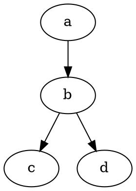
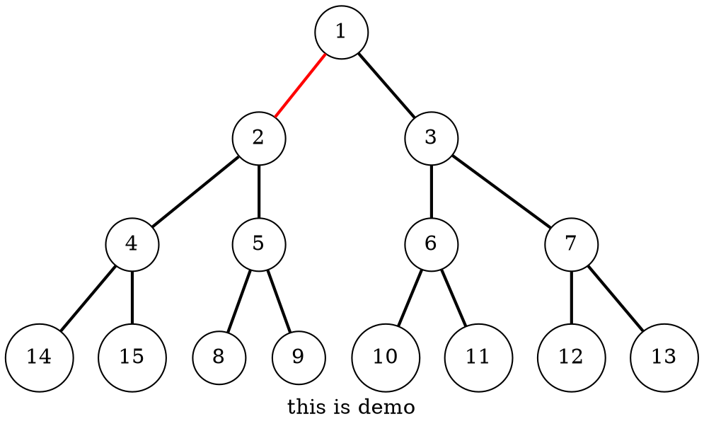
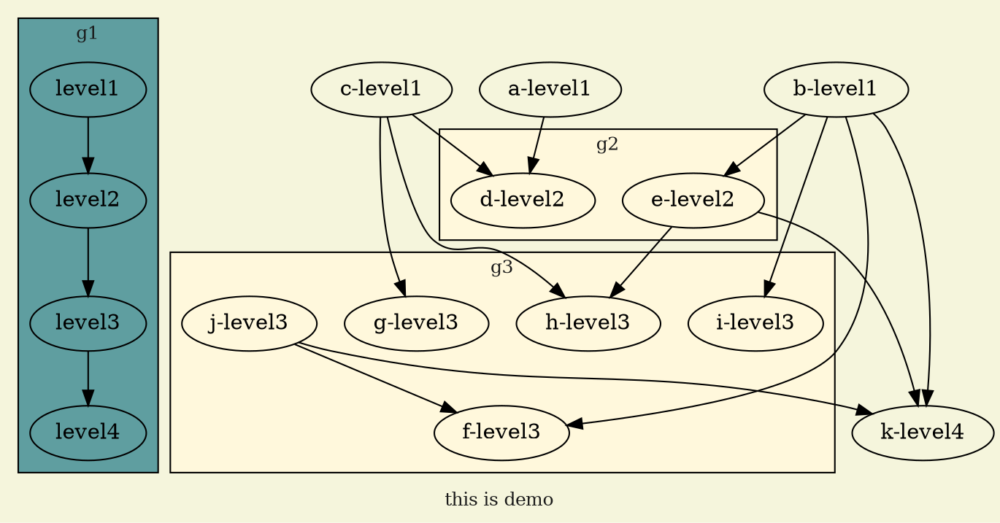

# [dot language 学习笔记](http://billhuang.me/study_dot.html)

[官方文档](http://www.graphviz.org/documentation/)

```dot
digraph graphname {
    a -> b -> c
    b -> d
}
```

```dot
graph g {
  label="this is demo"

  node [shape=circle]
  edge [style=bold]
  1 -- 2 [color=red]
  1 -- 3
  2 -- 4
  2 -- 5
  3 -- 6
  3 -- 7
  4 -- 14
  4 -- 15
  5 -- 8
  5 -- 9
  6 -- 10
  6 -- 11
  7 -- 12
  7 -- 13
}
```

```dot
digraph demo_subgraph {
  bgcolor=beige
  fontcolor=gray10
  fontsize=12
  label="this is demo"
  rankdir=TB

  /* 特别注意: 子图命名必须以"cluster"为前缀 */
  subgraph "cluster_g1" {
    label="g1"
    bgcolor=cadetblue
    "level1"->"level2"->"level3"->"level4"
  }

  subgraph "cluster_g2" {
    label="g2"
    bgcolor=cornsilk
    "level2"
    "d-level2"
    "e-level2"
  }

  subgraph "cluster_g3" {
    label="g3"
    bgcolor=cornsilk
    "level3"
    "f-level3"
    "g-level3"
    "h-level3"
    "i-level3"
    "j-level3"
  }

  "a-level1"->"d-level2"
  "e-level2"->{"h-level3", "k-level4"}
  "b-level1"->{"e-level2", "f-level3", "i-level3", "k-level4"}
  "c-level1"->{"d-level2", "g-level3", "h-level3"}
  "j-level3"->{"f-level3", "k-level4"}
}
```