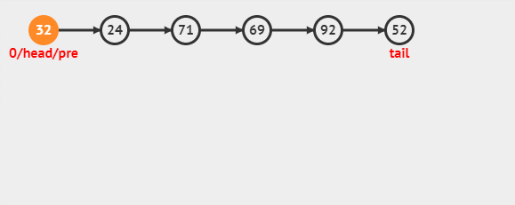
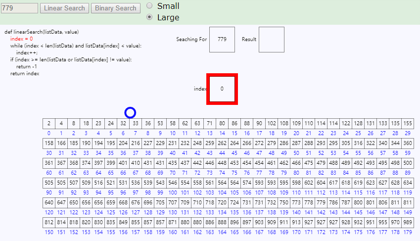
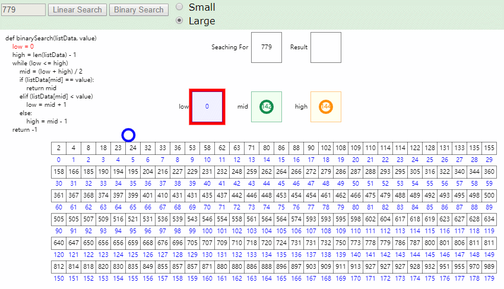

# 数据结构树

[数据结构图形化](https://www.cs.usfca.edu/~galles/visualization/Algorithms.html)
[visualgo](https://visualgo.net/zh)

|数据结构|优点|缺点|
| -- |-- | -- |
|顺序查找 无序链表| 小型问题 | 数量多的情况下很慢 |
|二分查找 有序数组| 查找效率高，空间占用 | 插入操作慢(resize) |
|二叉查找树| 实现简单 | 性能最坏可能很大，链接需要额外空间 |
|平衡二叉树查找树(红黑树)| 最优的查找插入效率 | 链接需要额外空间 |
|散列表 Hash| 快速查找插入 | 需要计算数据的hash，无法进行有序性(排序之类)操作，链接需要额外空间 |

## 符号表

### 无序链表

最简单的选择是链表，每个节点存储一个键值对。

1. 插入
    - 
2. 查找符号 5
    - 
3. 查找符号 92
    - 
4. 删除符号 69
    - 

#### 实现

```java
public class SequentialSearchST<Key, Value> {
    private int n;           // 键值对总数
    private Node first;      // the linked list of key-value pairs

    private class Node {
        private Key key;
        private Value val;
        private Node next;

        public Node(Key key, Value val, Node next)  {
            this.key  = key;
            this.val  = val;
            this.next = next;
        }
    }

    public boolean contains(Key key) {
        if (key == null) throw new IllegalArgumentException("argument to contains() is null");
        return get(key) != null;
    }

    public Value get(Key key) {
        if (key == null) throw new IllegalArgumentException("argument to get() is null"); 
        for (Node x = first; x != null; x = x.next) {
            if (key.equals(x.key))
                return x.val;
        }
        return null;
    }

    // 找到指定节点，找到则更新其值，否则插入
    public void put(Key key, Value val) {
        if (key == null) throw new IllegalArgumentException("first argument to put() is null"); 
        if (val == null) {
            delete(key);
            return;
        }

        for (Node x = first; x != null; x = x.next) {
            if (key.equals(x.key)) {
                x.val = val;
                return;
            }
        }
        first = new Node(key, val, first);
        n++;
    }

    public void delete(Key key) {
        if (key == null) throw new IllegalArgumentException("argument to delete() is null"); 
        first = delete(first, key);
    }

    // 递归找到并删除
    private Node delete(Node x, Key key) {
        if (x == null) return null;
        if (key.equals(x.key)) {
            n--;
            return x.next;
        }
        x.next = delete(x.next, key);
        return x;
    }

    public int size() {
        return n;
    }

    public static void main(String[] args) {
        SequentialSearchST<String, Integer> st = new SequentialSearchST<String, Integer>();
        for (int i = 0; !StdIn.isEmpty(); i++) {
            String key = StdIn.readString();
            st.put(key, i);
        }
        for (String s : st.keys())
            StdOut.println(s + " " + st.get(s));
    }
}
```

### 有序数组 -- 二分查找

使用基于二分查找实现的符号表使用的数据结构是一对平行的数组，一个存储键一个存储值，可以高效的实现`get()`等操作。

1. 线性查找
    - 
2. 二分查找
    - 

其核心是`rank()`方法，它返回的是小于给定键值的键的数量。
- 对于`get()`，只要键存在，`rank()`方法就能找到它。
- 对于`put()`，需要将`rank()`后边的键值向后移动一格。
- 动态调整数组，使 1/4 < (元素个数/数组长度)

#### 实现

```java

public class BinarySearchST<Key extends Comparable<Key>, Value> {
    private static final int INIT_CAPACITY = 2;
    private Key[] keys;
    private Value[] vals;
    private int n = 0;

    /**
     * 实现动态调整数组
     */
    public BinarySearchST() {
        this(INIT_CAPACITY);
    }

    public BinarySearchST(int capacity) { 
        keys = (Key[]) new Comparable[capacity]; 
        vals = (Value[]) new Object[capacity]; 
    }   

    // 对数组的大小进行调整
    // 创建新的capacity大小的数组，将原数组复制进去
    private void resize(int capacity) {
        Key[]   tempk = (Key[])   new Comparable[capacity];
        Value[] tempv = (Value[]) new Object[capacity];
        for (int i = 0; i < n; i++) {
            tempk[i] = keys[i];
            tempv[i] = vals[i];
        }
        vals = tempv;
        keys = tempk;
    }

    public int size() {
        return n;
    }

    public boolean isEmpty() {
        return size() == 0;
    }

    // 包含key
    public boolean contains(Key key) {
        if (key == null) throw new IllegalArgumentException("argument to contains() is null");
        return get(key) != null;
    }

    // 通过key得到value
    public Value get(Key key) {
        if (key == null) throw new IllegalArgumentException("argument to get() is null"); 
        if (isEmpty()) return null;
        int i = rank(key); 
        // 只是返回比key小的个数
        if (i < n && keys[i].compareTo(key) == 0) return vals[i];
        return null;
    } 

    // 返回比key小的键的个数
    // 因为所有的key都是已经排好序的，二分查找key
    public int rank(Key key) {
        if (key == null) throw new IllegalArgumentException("argument to rank() is null"); 

        int lo = 0, hi = n-1; 
        while (lo <= hi) { 
            int mid = lo + (hi - lo) / 2; 
            int cmp = key.compareTo(keys[mid]);
            if      (cmp < 0) hi = mid - 1; 
            else if (cmp > 0) lo = mid + 1; 
            else return mid; 
        } 
        return lo;
    } 

    // 插入并调整大小
    public void put(Key key, Value val)  {
        if (key == null) throw new IllegalArgumentException("first argument to put() is null"); 

        if (val == null) {
            delete(key);
            return;
        }

        int i = rank(key);

        // key存在，更改值
        if (i < n && keys[i].compareTo(key) == 0) {
            vals[i] = val;
            return;
        }

        // 调整数组大小为两倍
        if (n == keys.length) resize(2*keys.length);

        // 后边的元素从将要插入的地方后移一格
        for (int j = n; j > i; j--)  {
            keys[j] = keys[j-1];
            vals[j] = vals[j-1];
        }
        keys[i] = key;
        vals[i] = val;
        n++; // 元素个数
    } 

    // 删除并调整
    public void delete(Key key) {
        if (key == null) throw new IllegalArgumentException("argument to delete() is null"); 
        if (isEmpty()) return;

        int i = rank(key);

        // key不存在
        if (i == n || keys[i].compareTo(key) != 0) {
            return;
        }

        // 后边的元素从key的位置向前移动一格
        for (int j = i; j < n-1; j++)  {
            keys[j] = keys[j+1];
            vals[j] = vals[j+1];
        }

        n--; // 元素个数
        keys[n] = null;  // 防止对象游离(内存泄漏)
        vals[n] = null;

        // 当元素个数只有1/4数组个数的时候， 缩小一半
        if (n > 0 && n == keys.length/4) resize(keys.length/2);
    }
}

```

### 总结

一般情况下二分是比顺序查找要快的。但是二分没法做到高效插入(删除)。

|数据结构|查找(最坏)|插入(最坏)|查找(平均)|插入(平均)|
| -- |-- | -- | -- | -- |
|顺序查找 无序链表| N | N | N/2 | N |
|二分查找 有序数组| lgN | 2N | lgN | N |


## 二叉查找树

## 平衡二叉查找树

### 2-3 查找树

### 红黑树

### 总结

|数据结构|查找(最坏)|插入(最坏)|查找(平均)|插入(平均)|
| :--- | :--: | :--: | :--: | :--: |
|顺序查找 无序链表| N | N | N/2 | N |
|二分查找 有序数组| lgN | 2N | lgN | N |
|二叉查找树| N | N | 1.39lgN | 1.39lgN |
|2-3树 红黑树| 2lgN | 2lgN | 1.00lgN | 1.00lgN |

### B树，B-树，B+树，B*树

1. B树(Binary search tree) 
    - 二叉搜索树
2. B-树
    - 是一种多路搜索树，并不是二叉的
    - 数据库索引技术里大量使用B-树和B+树的数据结构
3. B+树
    - B+树是B-树的一个升级版，相对于B-树来说B+树更充分的利用了节点的空间，让查询速度更加稳定，其速度完全接近于二分法查找
    - B+跟B-树不同B+树的非叶子节点不保存关键字记录的指针，只进行数据索引，这样使得B+树每个非叶子节点所能保存的关键字大大增加
    - B+树叶子节点保存了父节点的所有关键字记录的指针，所有数据地址必须要到叶子节点才能获取到。所以每次数据查询的次数都一样
    - B+树叶子节点的关键字从小到大有序排列，左边结尾数据都会保存右边节点开始数据的指针
4. B*树
    - B*树是B+树的变种，在B+树的非根和非叶子结点再增加指向兄弟的指针


- B树
    - 二叉树，每个结点只存储一个关键字，等于则命中，小于走左结点，大于走右结点；
- B-树
    - 多路搜索树，每个结点存储M/2到M个关键字，非叶子结点存储指向关键字范围的子结点；所有关键字在整颗树中出现，且只出现一次，非叶子结点可以命中
- B+树
    - 在B-树基础上，为叶子结点增加链表指针，所有关键字都在叶子结点中出现，非叶子结点作为叶子结点的索引；B+树总是到叶子结点才命中
- B*树
    - 在B+树基础上，为非叶子结点也增加链表指针，将结点的最低利用率从1/2提高到2/3；


## 散列表