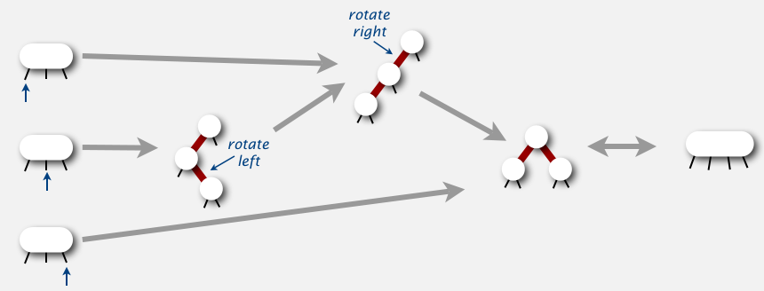
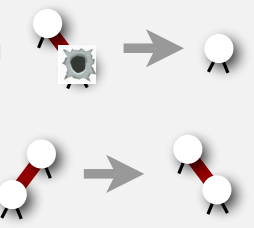

---
html:
  embed_local_images: true
  embed_svg: true
  offline: false
  toc: true

print_background: false
# 使用 vscode 插件 markdown-preview-enhanced 生成html
---

# 查找

[TOC]

[数据结构图形化](https://www.cs.usfca.edu/~galles/visualization/Algorithms.html)
[visualgo](https://visualgo.net/zh)

| 数据结构                 | 优点                 | 缺点                                                               |
| ------------------------ | -------------------- | ------------------------------------------------------------------ |
| 顺序查找 无序链表        | 小型问题             | 数量多的情况下很慢                                                 |
| 二分查找 有序数组        | 查找效率高，空间占用 | 插入操作慢(resize)                                                 |
| 二叉查找树               | 实现简单             | 性能最坏可能很大，链接需要额外空间                                 |
| 平衡二叉树查找树(红黑树) | 最优的查找插入效率   | 链接需要额外空间                                                   |
| 散列表 Hash              | 快速查找插入         | 需要计算数据的hash，无法进行有序性(排序之类)操作，链接需要额外空间 |

## 1 符号表

### 1.1 无序链表

最简单的选择是链表，每个结点存储一个键值对。

1. 插入
    - 
2. 查找符号 5
    - 
3. 查找符号 92
    - 
4. 删除符号 69
    - 

#### 1.1.1 实现

```java
public class SequentialSearchST<Key, Value> {
    private int n;           // 键值对总数
    private Node first;      // the linked list of key-value pairs

    private class Node {
        private Key key;
        private Value val;
        private Node next;

        public Node(Key key, Value val, Node next)  {
            this.key  = key;
            this.val  = val;
            this.next = next;
        }
    }

    public boolean contains(Key key) {
        if (key == null) throw new IllegalArgumentException("argument to contains() is null");
        return get(key) != null;
    }

    public Value get(Key key) {
        if (key == null) throw new IllegalArgumentException("argument to get() is null"); 
        for (Node x = first; x != null; x = x.next) {
            if (key.equals(x.key))
                return x.val;
        }
        return null;
    }

    // 找到指定结点，找到则更新其值，否则插入
    public void put(Key key, Value val) {
        if (key == null) throw new IllegalArgumentException("first argument to put() is null"); 
        if (val == null) {
            delete(key);
            return;
        }

        for (Node x = first; x != null; x = x.next) {
            if (key.equals(x.key)) {
                x.val = val;
                return;
            }
        }
        first = new Node(key, val, first);
        n++;
    }

    public void delete(Key key) {
        if (key == null) throw new IllegalArgumentException("argument to delete() is null"); 
        first = delete(first, key);
    }

    // 递归找到并删除
    private Node delete(Node x, Key key) {
        if (x == null) return null;
        if (key.equals(x.key)) {
            n--;
            return x.next;
        }
        x.next = delete(x.next, key);
        return x;
    }

    public int size() {
        return n;
    }
}
```

### 1.2 有序数组 -- 二分查找

使用基于二分查找实现的符号表使用的数据结构是一对平行的数组，一个存储键一个存储值，可以高效的实现`get()`等操作。

1. 线性查找
    - 
2. 二分查找
    - 

其核心是`rank()`方法，它返回的是小于给定键值的键的数量。
- 对于`get()`，只要键存在，`rank()`方法就能找到它。
- 对于`put()`，需要将`rank()`后边的键值向后移动一格。
- 动态调整数组，使 1/4 < (元素个数/数组长度)

#### 1.2.1 实现

```java

public class BinarySearchST<Key extends Comparable<Key>, Value> {
    private static final int INIT_CAPACITY = 2;
    private Key[] keys;
    private Value[] vals;
    private int n = 0;

    /**
     * 实现动态调整数组
     */
    public BinarySearchST() {
        this(INIT_CAPACITY);
    }

    public BinarySearchST(int capacity) { 
        keys = (Key[]) new Comparable[capacity]; 
        vals = (Value[]) new Object[capacity]; 
    }   

    // 对数组的大小进行调整
    // 创建新的capacity大小的数组，将原数组复制进去
    private void resize(int capacity) {
        Key[]   tempk = (Key[])   new Comparable[capacity];
        Value[] tempv = (Value[]) new Object[capacity];
        for (int i = 0; i < n; i++) {
            tempk[i] = keys[i];
            tempv[i] = vals[i];
        }
        vals = tempv;
        keys = tempk;
    }

    public int size() {
        return n;
    }

    public boolean isEmpty() {
        return size() == 0;
    }

    // 包含key
    public boolean contains(Key key) {
        if (key == null) throw new IllegalArgumentException("argument to contains() is null");
        return get(key) != null;
    }

    // 通过key得到value
    public Value get(Key key) {
        if (key == null) throw new IllegalArgumentException("argument to get() is null"); 
        if (isEmpty()) return null;
        int i = rank(key); 
        // 只是返回比key小的个数
        if (i < n && keys[i].compareTo(key) == 0) return vals[i];
        return null;
    } 

    // 返回比key小的键的个数
    // 因为所有的key都是已经排好序的，二分查找key
    public int rank(Key key) {
        if (key == null) throw new IllegalArgumentException("argument to rank() is null"); 

        int lo = 0, hi = n-1; 
        while (lo <= hi) { 
            int mid = lo + (hi - lo) / 2; 
            int cmp = key.compareTo(keys[mid]);
            if      (cmp < 0) hi = mid - 1; 
            else if (cmp > 0) lo = mid + 1; 
            else return mid; 
        } 
        return lo;
    } 

    // 插入并调整大小
    public void put(Key key, Value val)  {
        if (key == null) throw new IllegalArgumentException("first argument to put() is null"); 

        if (val == null) {
            delete(key);
            return;
        }

        int i = rank(key);

        // key存在，更改值
        if (i < n && keys[i].compareTo(key) == 0) {
            vals[i] = val;
            return;
        }

        // 调整数组大小为两倍
        if (n == keys.length) resize(2*keys.length);

        // 后边的元素从将要插入的地方后移一格
        for (int j = n; j > i; j--)  {
            keys[j] = keys[j-1];
            vals[j] = vals[j-1];
        }
        keys[i] = key;
        vals[i] = val;
        n++; // 元素个数
    } 

    // 删除并调整
    public void delete(Key key) {
        if (key == null) throw new IllegalArgumentException("argument to delete() is null"); 
        if (isEmpty()) return;

        int i = rank(key);

        // key不存在
        if (i == n || keys[i].compareTo(key) != 0) {
            return;
        }

        // 后边的元素从key的位置向前移动一格
        for (int j = i; j < n-1; j++)  {
            keys[j] = keys[j+1];
            vals[j] = vals[j+1];
        }

        n--; // 元素个数
        keys[n] = null;  // 防止对象游离(内存泄漏)
        vals[n] = null;

        // 当元素个数只有1/4数组个数的时候， 缩小一半
        if (n > 0 && n == keys.length/4) resize(keys.length/2);
    }
}

```

### 1.3 总结

一般情况下二分是比顺序查找要快的。但是二分没法做到高效插入(删除)。

| 数据结构          |    >     | 最坏情况 |    >     | 平均情况 |
| :---------------- | :------: | :------: | :------: | :------: |
|                   | **查找** | **插入** | **查找** | **插入** |
| 顺序查找 无序链表 |    N     |    N     |   N/2    |    N     |
| 二分查找 有序数组 |   lgN    |    2N    |   lgN    |    N     |


## 2 查找树

### 2.1 二叉查找树 Binary Search Tree

一个典型的二叉树


1. 查找（与二分查找几乎一致）
    1. 如果树是空的，查找未命中。对于未命中的查找，终点是空结点。
    2. 被查找的键和根结点的键相同，查找命中
    3. 递归地在子树中查找
        - 被查找的键较小则选择左子树
        - 较大选择右子树
    4. 最好、平均、最坏情况 
2. 插入（和查找类似）
    1. 树是空的，返回含有该键值的新结点
    2. 被查找的键小于根结点的键，在左子树中插入该键，否则在右边
    3. 随机插入的情况 
3. 得到树的最小值
    1. 相当于得到结点的最左子结点
    2. 递归得到左子结点直到左子结点的左子树为空
3. 删除
    1. 删除最大最小值
        - 最小：深入根结点的左子结点直到遇到空链接，然后将指向该结点的链接指向该结点的右子树
        - 删除最大是删除最小的相反操作
    2. 删除： 删除结点x后用它的后继结点代替（其右子树的最小结点）
        > 最早由 T. Hibbard 在1962年解决了这个难题
    3. 随机插入删除 
4. 实际上在结点的选择上是随机的，但是在经历足够长的时间插入删除后最终会变为N的时间复杂度

#### 2.1.1 例子

- 随机序列 `15,41,69,60,4,61,5,57,90,94,56,85,33,47,76,14,64`
    1. 创建/插入
        - 
    2. 查找 `10,33,56,55`
        - 
    3. 得到最大最小值
        - 
        - 
    4. 删除最小
        - 
    5. 删除 41
        - 
    6. 从随机序列中删除 `5,14,90,69,41`
        - 
- 顺序序列
    1. 创建/插入 顺序序列 `1,2,3,4,5,6,7,8,9,10`
        - 
    2. 从顺序序列中删除 `10, 5, 1`
        - 
    3. 查找 相当于线性查找 `5, 11`
        - 
    4. 相当于链表

#### 2.1.2 实现

```java
public class BST<Key extends Comparable<Key>, Value> {
    private Node root;             // 根结点

    private class Node {
        private Key key;           // key排序
        private Value val;         // 数据
        private Node left, right;  // 左右子树
        private int size;          // 孩子的个数

        public Node(Key key, Value val, int size) {
            this.key = key;
            this.val = val;
            this.size = size;
        }
    }

    public boolean isEmpty() {
        return size() == 0;
    }

    public int size() {
        return size(root);
    }

    private int size(Node x) {
        if (x == null) return 0;
        else return x.size;
    }

    public boolean contains(Key key) {
        if (key == null) throw new IllegalArgumentException("argument to contains() is null");
        return get(key) != null;
    }

    public Value get(Key key) {
        return get(root, key);
    }

    // 和二分查找类似
    private Value get(Node x, Key key) {
        if (key == null) throw new IllegalArgumentException("called get() with a null key");
        if (x == null) return null;
        int cmp = key.compareTo(x.key);
        if      (cmp < 0) return get(x.left, key);
        else if (cmp > 0) return get(x.right, key);
        else              return x.val;
    }

    public void put(Key key, Value val) {
        if (key == null) throw new IllegalArgumentException("calledput() with a null key");
        if (val == null) {
            delete(key);
            return;
        }
        root = put(root, key, val);
        assert check();
    }

    // 插入
    private Node put(Node x, Key key, Value val) {
        if (x == null) return new Node(key, val, 1); // 空结点直接新建
        int cmp = key.compareTo(x.key); // 大的往右，小的往左
        if      (cmp < 0) x.left  = put(x.left,  key, val);
        else if (cmp > 0) x.right = put(x.right, key, val);
        else              x.val   = val;
        x.size = 1 + size(x.left) + size(x.right); // 更新size
        return x;
    }

    public void deleteMin() {
        if (isEmpty()) throw new NoSuchElementException("Symbol table underflow");
        root = deleteMin(root);
    }

    // 深入根结点的左子结点直到遇到空链接，然后将指向该结点的链接指向该结点的右子树
    // 返回删除后的头结点
    private Node deleteMin(Node x) {
        if (x.left == null) return x.right;
        x.left = deleteMin(x.left); 
        x.size = size(x.left) + size(x.right) + 1;
        return x;
    }

    public void deleteMax() {
        if (isEmpty()) throw new NoSuchElementException("Symbol table underflow");
        root = deleteMax(root);
    }

    private Node deleteMax(Node x) {
        if (x.right == null) return x.left;
        x.right = deleteMax(x.right);
        x.size = size(x.left) + size(x.right) + 1;
        return x;

    public void delete(Key key) {
        if (key == null) throw new IllegalArgumentException("called delete() with a null key");
        root = delete(root, key);
    }

    private Node delete(Node x, Key key) {
        if (x == null) return null;

        int cmp = key.compareTo(x.key); // 从左右子树中找到结点
        if      (cmp < 0) x.left  = delete(x.left,  key);
        else if (cmp > 0) x.right = delete(x.right, key);
        else { // 删除结点x后，用其右子树的最小结点代替
            if (x.right == null) return x.left;
            if (x.left  == null) return x.right;
            Node t = x;
            x = min(t.right);
            x.right = deleteMin(t.right);
            x.left = t.left;
        } 
        x.size = size(x.left) + size(x.right) + 1;
        return x;
    } 

    public Key min() {
        if (isEmpty()) throw new NoSuchElementException("called min() with empty symbol table");
        return min(root).key;
    } 

    private Node min(Node x) { 
        if (x.left == null) return x; 
        else                return min(x.left); 
    } 

    public Key max() {
        if (isEmpty()) throw new NoSuchElementException("called max() with empty symbol table");
        return max(root).key;
    } 

    private Node max(Node x) {
        if (x.right == null) return x; 
        else                 return max(x.right); 
    }

    public int rank(Key key) {
        if (key == null) throw new IllegalArgumentException("argument to rank() is null");
        return rank(key, root);
    } 

    // 比key小的数量
    private int rank(Key key, Node x) {
        if (x == null) return 0; 
        int cmp = key.compareTo(x.key); 
        if      (cmp < 0) return rank(key, x.left); 
        else if (cmp > 0) return 1 + size(x.left) + rank(key, x.right); // key在右子树中：左子树的size + 1（跟结点）+ key在以右孩子为跟的树中的rank
        else              return size(x.left); 
    } 

    public int height() {
        return height(root);
    }
    private int height(Node x) { // 树的高度
        if (x == null) return -1;
        return 1 + Math.max(height(x.left), height(x.right));
    }
}
```

#### 2.1.3 二叉查找树的性能

| 数据结构          |    >     | 最坏情况 |    >     | 平均情况 |
| :---------------- | :------: | :------: | :------: | :------: |
|                   | **查找** | **插入** | **查找** | **插入** |
| 顺序查找 无序链表 |    N     |    N     |   N/2    |    N     |
| 二分查找 有序数组 |   lgN    |    2N    |   lgN    |    N     |
| 二叉查找树        |    N     |    N     | 1.39lgN  | 1.39lgN  |


## 3 平衡查找树 (Balanced search trees)

### 3.1 2-3查找树

2–3树由约翰·霍普克洛夫特于1970年发明

下面是一个典型的2-3 树，维持了完美的平衡，每个到根结点的路径长度一致。

可以看到2结点和普通二叉搜索树一样。3结点的最左全部小于该结点，中间的在两结点之间，右边的全部大于该结点。

查找十分简单，与二叉搜索树类似。

2-3的操作，将临时的4结点分裂成2-3结点


分裂4结点到3结点时其他的子结点并没有受到影响，只作用于其结点及父结点。


使用随机值构造的2-3数


插入数据 `[3, 1, 5, 4, 2, 9, 10, 8, 7, 6]`


尽管可以用不同数据结构表示2结点或3结点，但是太复杂了，要维护好几种不同的结点但是2-3，其间的各种转换可能更耗时，但红黑树可以，红黑基于2-3树。

### 3.2 红黑树 Red-Black Trees --> 左倾红黑树

#### 3.2.1 简介

它在1972年由鲁道夫·贝尔发明，被称为"对称二叉B树"，它现代的名字源于 Leo J. Guibas 和 Robert Sedgewick 于1978年写的一篇论文。Robert Sedgewick在2008年的论文[Left-leaning Red-Black Trees](http://www.cs.princeton.edu/~rs/talks/LLRB/LLRB.pdf)中将设计出左倾红黑树，它红黑树的变体，并保证对操作相同渐近的复杂性，但被设计成更容易实现。


红黑树中将树的链接分为两种类型：
1. 红链接将两个结点链接起来构成 3结点
2. 黑链接则是2-3树中的普通链接

使用这种方法的好处是不用修改就可以用标准二叉查找树的`get()`方法，对任意 2-3树 只要对结点进行转换，就能得到一个红黑树。

定义：
1. 红链接均为左链接
2. 没有任何一个结点同时和两个红链相连
3. 该树是**完美的黑色平衡**的，任意叶子结点到根结点的黒链接的数量相同

#### 3.2.2 将2-3树表示为红黑树


红黑树将红色的水平就是23数


#### 3.2.3 颜色表示


```java
private static final boolean RED = true; // 定义全局变量
private static final boolean BLACK = false;

private class Node {
    Key key;
    Value val;
    Node left, right; // 子树
    int N; // 子树的数量
    boolean color; // color of link from
    // parent to this node
    Node(Key key, Value val, int N, boolean color) {
        this.key = key;
        this.val = val;
        this.N = N;
        this.color = color;
    }
}
private boolean isRed(Node x) {
    if (x == null) return false;
    return x.color == RED;
}
```

#### 3.2.4 三种基本操作

将红色的右链接转换为左链接叫左旋。rotate-left


将红色的左链接转换为右链接叫右旋。rotate-right


变色 flip colors


红黑树的三种操作及代码


#### 3.2.5 插入

1. 像二叉查找树一样添加新结点，使用红链接 链接父结点
2. 如有必要，需要旋转以获得正确的3结点或4结点

##### 3.2.5.1 向树底的2结点插入新键（树只含有一个2结点）


两种情况：左、右。

因为在红黑树定义了红链接均为左链接，所以如果是向右插入需要左旋

##### 3.2.5.2 向一个3结点插入新键（树只含有一个3结点）



3结点有三种情况：左中右

##### 3.2.5.3 分裂一个4结点

颜色转换 flip colors


##### 3.2.5.4 向树底部的3结点插入新键（相当于在树底分裂一个4结点）

2种情况：父结点是一个2结点或者父结点是一个3结点

1. 父结点是一个2结点
   1. 4结点在父结点左边
        
   2. 4结点在父结点右边
        
2. 父结点是一个3结点
   1. 4结点在父结点左边
        
   2. 4结点在父结点中间
        
   4. 4结点在父结点右边
        

##### 3.2.5.5 将红链在树中向上传递

在23树的插入算法中需要分解3结点，将中间键插入父结点，直到遇到一个2结点或者根结点。
在父结点看来，这样处理一个新的红结点的方式和插入一个的红结点完全一样。

其中2结点就直接插入了。

要在一个3结点下插入新键，先创建一个临时的4结点，将其分解并将红链接由中间键传递给它的父结点。重复这个过程，直到遇到一个2结点或者根结点。

总之，使用左旋，右旋，变色 三个步骤就能完成插入操作。

红黑树三种操作间的转换


##### 3.2.5.6 [插入例子](http://inst.eecs.berkeley.edu/~cs61b/fa17/materials/demos/ll-red-black-2_3-demo.html)


插入255个随机数


插入255个升序的数


插入255个降序的数


##### 3.2.5.7  插入实现

```java
public void put(Key key, Value val) { 
    root = put(root, key, val);
    root.color = BLACK;
}
private Node put(Node h, Key key, Value val) {
    if (h == null) // Do standard insert, with red link to parent.
        return new Node(key, val, 1, RED);

    int cmp = key.compareTo(h.key);
    if (cmp < 0)        h.left = put(h.left, key, val);
    else if (cmp > 0)   h.right = put(h.right, key, val);
    else                h.val = val; // key存在则更新值

    if (isRed(h.right) && !isRed(h.left)) h = rotateLeft(h); // 右红左旋
    if (isRed(h.left) && isRed(h.left.left)) h = rotateRight(h); // 左两个子结点都红 右旋（右旋后变色）
    if (isRed(h.left) && isRed(h.right)) flipColors(h); // 左右都红变色

    h.N = size(h.left) + size(h.right) + 1;
    return h;
}
```

### 3.3 删除

从树底删除

从树底的3结点中删除一个键很简单，但是从树底的2结点中删除一键会留下一个空结点，这样会破坏树的平衡。

所以为了保证不会删除一个2结点，需要沿着左链接（或右链接）向下进行变换，确保当前结点不是2结点（可能是3结点或者临时的4结点）。

#### 3.3.1 2-3-4树

234树的插入算法既能向上也能向下进行变换。

234树中允许存在前边见过的4结点，其中沿查找路径向下变换是为了保证当前结点不是4-结点（这样树底才有空间来插入新键），沿路径向上变换是为了将之前创建的4结点配平。

1. 向下的变换中跟2-3树中分解临时4结点完全相同
2. 如果根结点是4结点，将其分解成两个2结点，树高加1
    - 
3. 在向下查找的过程中，如果遇到父结点是2结点的4结点，将4结点分解成两个2结点，并将中间键传递给父结点。
    - 
4. 如果遇到一个父结点为3结点的4结点，将4结点分解成两个2结点，并将中间键传递给父结点，使父结点变为4结点
    - 
5. 到达树底之后，只会遇到2结点或者3结点，所以可以插入新的键。
    - 

删除的诀窍是：

保证被删除的一定是红色，如果不是红色就想办法把它变成红色，就是说最后真正出现删除操作的key所在的2-3树结点里的key数一定是大于等于2的。

这时候就需要，从一开始就必须从上面，左或右把其他结点的key借过来，
免得删除操作出现在一个1个key结点中，破坏了树的平衡性。

#### 3.3.2 删除最大

最大值肯定在最右

##### 3.3.2.1 在234树中

1. 删除的结点在3结点或者4结点中，直接删除掉
   - 
2. 要删除的结点是2结点，如果直接删除就会破坏红黑树的平衡，所以在删除之前，要进行一定的变换，变成3结点或者4结点，也就是借一个或者两个结点过来。
   - 
   - 根据父结点的不同。3结点或者4结点和兄弟结点的不同可以分为六种情况，但其中又可以分为两类
       1. 兄弟结点不是2结点，就可以直接从兄弟结点借一个结点过来
       2. 兄弟结点是2结点，则从父结点中借一个过来，然后和兄弟结点合并成一个4结点

##### 3.3.2.2 红黑树中
1. 在树底，且是2结点或3结点，（对应234树中 不需要从兄弟结点中借一结点过来）
    - 
2. 对应234树中，需要从兄弟结点中借一结点过来。
    1. `h.left.left == BLACK`（兄弟结点是个2结点）
        - 
    2. `h.left.left == RED`（兄弟结点不是2结点，是个3结点或4结点）
        - 
    3.  这一步是为了将红链接向右边的子结点移动(`moveRedRight`)。
        ```java
        private Node moveRedRight(Node h) {
            colorFlip(h);
            if (isRed(h.left.left)) {
                h = rotateRight(h);
                colorFlip(h);
            }
            return h;
        }
        ```

##### 3.3.2.3 步骤

1. 首先如果左链接为红则右旋，因为找最大结点在最右边
2. 如果，已经到了最底部，那么直接移除就行，移除的要求是最底部的结点一定是red
3. 如果遇到了2结点就借一个结点
4. 继续往下递归查找
5. 删除完毕，就恢复红黑树

##### 3.3.2.3 举例


##### 3.3.2.5 删除最大的实现
```java
public void deleteMax() {
    root = deleteMax(root);
    root.color = BLACK;
}
private Node deleteMax(Node h) {
    if (isRed(h.left)) // 这里比删除最小多一步 红链在左侧右旋  以便传递到右侧的子结点中
        h = rotateRight(h);

    if (h.right == null)
        return null;

    if (!isRed(h.right) && !isRed(h.right.left))  // 可能向兄弟结点借一个结点
        h = moveRedRight(h); // 红链接向下传递

    h.left = deleteMax(h.left);
    //向上修复分解临时4结点 
    return fixUp(h);
}
```


删除最大


#### 3.3.3 删除最小

##### 3.3.3.1 在234树中

- 不是2结点的话可以直接删除
- 跟是2结点且它的两个子结点都是2结点，可以直接将这三个结点变为一个4结点。
    1. 
- 否则需要保证根结点的左子结点不是2结点，比如从其兄弟结点借一个过来。
    1. 当前结点的左子结点不是2结点
        - 
    2. 当前结点的左子结点是2结点，它的兄弟结点不是2结点，则从亲兄弟结点中移动一个键到左子结点中
        - 
    3. 左子结点是2结点，且其亲兄弟结点也是2结点，则将左子结点、父结点中的最小键和亲兄弟结点结合成为一个4结点，父结点由3结点变为2结点或者由4结点变为3结点。
        - 
- 总结
    1. 不变量，就是h或者h的left一定是红色的（不是2结点）。遇到底部的红结点，就直接删除了。
    2. 然后就是对于2结点需要从兄弟结点中借一个结点变成3结点或者4结点，2结点的条件就是，h.left和h.left.left均为黑色的。
    3. 然后其中又有两种情况，
       1. 如果h.right.left为黑，则说明兄弟结点也是2结点，就从父结点借结点，直接color flip即可
       2. 如果h.right.left为红，则可以直接从兄弟结点借一个结点过来

在遍历查找的过程执行这个过程，最后能够得到一个含有最小键的3结点或4结点，将其删除后，再回头向上分解所有的临时4结点。

##### 3.3.3.2 在红黑树中

1. 最简单的情况，不是2结点 `h.left = RED`
    - 
2. 需要从兄弟结点借一个结点的情况
   - `h.left && h.left.left = BLACK`
   - 两种情况，取决于`h.right.left`
       - BLACK(兄弟结点是2结点，需要从父结点借一个)
           - 
       - RED(兄弟结点不是2结点，从兄弟结点借一个)，先将 `h.right.left` 右旋，然后将 `h.right` 左旋， 然后变色h
           - 
           - 实现(将红链接向左子结点移动)
               ```java
               private Node moveRedLeft(Node h) {
                   colorFlip(h);
                   if (isRed(h.right.left)) {
                       h.right = rotateRight(h.right);
                       h = rotateLeft(h);
                       colorFlip(h);
                   }
                   return h;
               }
               ```

删除最小的实现
```java
public void deleteMin() {
    if (!isRed(root.left) && !isRed(root.right))
        root.color = RED;

    root = deleteMin(root);
    root.color = BLACK;
}
private Node deleteMin(Node h) {
    if (h.left == null) // 从树底移除(h必须是红链接)
        return null;

    if (!isRed(h.left) && !isRed(h.left.left)) // 可能向兄弟结点借一个结点
        h = moveRedLeft(h); // 红链接向下传递

    h.left = deleteMin(h.left);

    //向上修复分解临时4结点 
    return fixUp(h);
}
```

例子


删除最小


**删除操作的原则**
1. 删除的当前结点不能是2-node
2. 如果有必要可以变换成4-node
3. 从底部删除结点
4. 向上的fix过程中，消除4-node

#### 3.3.4 随机删除

如果要删除一个结点，把要删除的那个结点和最底部的结点交换，然后就变成删除最底部的结点，
就可以转换成删除最大结点或者最小结点了。
所以先讲最大结点和最小结点的删除。

同时这样也把问题简化了，因为删除最大和最小结点的方法已经分析过了。

[双击结点删除](http://inst.eecs.berkeley.edu/~cs61b/fa17/materials/demos/ll-red-black-2_3-demo.html)

1. 在查找路径上进行和删除最小键相同的变换操作，这样可以保证在查找过程中任意的当前结点不是2结点。
2. 如果被查找的键在树的底部（基于上述变换操作直到树底，结点肯定不是2结点），直接删除。
3. 如果不在底部，则将找到的结点和其后继结点交换（跟二叉查找树中的删除一样）。
    - 举例：如果要删除D结点，可以选择用D结点左子树的最大结点或者右子树的最小结点来替换D的值，然后再删除最大结点或者最小结点就可以了。
    - 
    - ```java
        h.key = min(h.right);
        h.value = get(h.right, h.key);
        h.right = deleteMin(h.right);
    ```
4. 因为当前结点不是必然不是2结点，所以就是在根结点不是2结点的子树中删除最小的键，同样删除之后需要向上回溯并分解临时4结点。


随机删除


#### 3.3.5 实现

```java
public class RedBlackBST<Key extends Comparable<Key>, Value> {

    private static final boolean RED   = true;
    private static final boolean BLACK = false;

    private Node root;     // 跟结点

    private class Node {
        private Key key; 
        private Value val;
        private Node left, right;
        private boolean color;
        private int size;

        public Node(Key key, Value val, boolean color, int size) {
            this.key = key;
            this.val = val;
            this.color = color;
            this.size = size;
        }
    }

    private boolean isRed(Node x) {
        if (x == null) return false;
        return x.color == RED;
    }

    private int size(Node x) {
        if (x == null) return 0;
        return x.size;
    } 

    public int size() {
        return size(root);
    }

    public boolean isEmpty() {
        return root == null;
    }

    // 查找 和二叉查找树一致
    public Value get(Key key) {
        if (key == null) throw new IllegalArgumentException("argument to get() is null");
        return get(root, key);
    }

    private Value get(Node x, Key key) {
        while (x != null) {
            int cmp = key.compareTo(x.key);
            if      (cmp < 0) x = x.left;
            else if (cmp > 0) x = x.right;
            else              return x.val;
        }
        return null;
    }

    public boolean contains(Key key) {
        return get(key) != null;
    }

   /***************************************************************************
    *  Red-black tree 插入.
    ***************************************************************************/

    public void put(Key key, Value val) {
        if (key == null) throw new IllegalArgumentException("first argument to put() is null");
        if (val == null) {
            delete(key);
            return;
        }

        root = put(root, key, val);
        root.color = BLACK;
        // assert check();
    }

    // insert the key-value pair in the subtree rooted at h
    private Node put(Node h, Key key, Value val) { 
        if (h == null) return new Node(key, val, RED, 1);

        int cmp = key.compareTo(h.key);
        if      (cmp < 0) h.left  = put(h.left,  key, val); 
        else if (cmp > 0) h.right = put(h.right, key, val); 
        else              h.val   = val;

        // fix-up any right-leaning links
        if (isRed(h.right) && !isRed(h.left))      h = rotateLeft(h);
        if (isRed(h.left)  &&  isRed(h.left.left)) h = rotateRight(h);
        if (isRed(h.left)  &&  isRed(h.right))     flipColors(h);
        h.size = size(h.left) + size(h.right) + 1;

        return h;
    }

   /***************************************************************************
    *  Red-black tree 删除.
    ***************************************************************************/

    public void deleteMin() {
        if (isEmpty()) throw new NoSuchElementException("BST underflow");

        // if both children of root are black, set root to red
        if (!isRed(root.left) && !isRed(root.right))
            root.color = RED;

        root = deleteMin(root);
        if (!isEmpty()) root.color = BLACK;
        // assert check();
    }

    // delete the key-value pair with the minimum key rooted at h
    private Node deleteMin(Node h) { 
        if (h.left == null)
            return null;

        if (!isRed(h.left) && !isRed(h.left.left))
            h = moveRedLeft(h);

        h.left = deleteMin(h.left);
        return balance(h);
    }

    public void deleteMax() {
        if (isEmpty()) throw new NoSuchElementException("BST underflow");

        // if both children of root are black, set root to red
        if (!isRed(root.left) && !isRed(root.right))
            root.color = RED;

        root = deleteMax(root);
        if (!isEmpty()) root.color = BLACK;
        // assert check();
    }

    // delete the key-value pair with the maximum key rooted at h
    private Node deleteMax(Node h) { 
        if (isRed(h.left))
            h = rotateRight(h);

        if (h.right == null)
            return null;

        if (!isRed(h.right) && !isRed(h.right.left))
            h = moveRedRight(h);

        h.right = deleteMax(h.right);

        return balance(h);
    }

    public void delete(Key key) { 
        if (key == null) throw new IllegalArgumentException("argument to delete() is null");
        if (!contains(key)) return;

        // if both children of root are black, set root to red
        if (!isRed(root.left) && !isRed(root.right))
            root.color = RED;

        root = delete(root, key);
        if (!isEmpty()) root.color = BLACK;
    }

    private Node delete(Node h, Key key) { 
        if (key.compareTo(h.key) < 0)  { // key在左边
            if (!isRed(h.left) && !isRed(h.left.left)) // 红链接左移
                h = moveRedLeft(h);
            h.left = delete(h.left, key);
        } else { // key在右边
            if (isRed(h.left)) // 保证当前的结点一定是红链接
                h = rotateRight(h);
            if (key.compareTo(h.key) == 0 && (h.right == null))
                return null;
            if (!isRed(h.right) && !isRed(h.right.left)) // 红链接右移
                h = moveRedRight(h);
            if (key.compareTo(h.key) == 0) {
                h.val = get(h.right, min(h.right).key);
                h.key = min(h.right).key;
                h.right = deleteMin(h.right);
            }
            else h.right = delete(h.right, key);
        }
        return balance(h);
    }

   /***************************************************************************
    *  Red-black tree 操作.
    ***************************************************************************/

    // 右旋 将红色的左链接转换为右链接叫右旋
    private Node rotateRight(Node h) {
        Node x = h.left;
        h.left = x.right;
        x.right = h;
        x.color = x.right.color;
        x.right.color = RED;
        x.size = h.size;
        h.size = size(h.left) + size(h.right) + 1;
        return x;
    }

    //左旋 将红色的右链接转换为左链接叫左旋
    private Node rotateLeft(Node h) {
        Node x = h.right;
        h.right = x.left;
        x.left = h;
        x.color = x.left.color;
        x.left.color = RED;
        x.size = h.size;
        h.size = size(h.left) + size(h.right) + 1;
        return x;
    }

    //h的两个自链接颜色相同且到h的颜色与子链接颜色不同
    // 注意：
    // 这里的flipColors方法会补全三条链的颜色，而不是实现插入操作时实现的flipColors方法
    // 对于删除，将父结点设为黑而将两个子结点都设为红
    private void flipColors(Node h) {
        h.color = !h.color;
        h.left.color = !h.left.color;
        h.right.color = !h.right.color;
    }

    // 假设h为红色，h.left和h.left.left都是黑色
    // 将h.left或h.left的子结点之一变为红色
    private Node moveRedLeft(Node h) {
        // assert (h != null);
        // assert isRed(h) && !isRed(h.left) && !isRed(h.left.left);

        flipColors(h);
        if (isRed(h.right.left)) { 
            h.right = rotateRight(h.right);
            h = rotateLeft(h);
            flipColors(h);
        }
        return h;
    }

    // 假设h为红色，h.right和h.right.left都是黑色
    // 将h.right或h.right的子结点之一变为红色
    private Node moveRedRight(Node h) {
        // assert (h != null);
        // assert isRed(h) && !isRed(h.right) && !isRed(h.right.left);
        flipColors(h);
        if (isRed(h.left.left)) { 
            h = rotateRight(h);
            flipColors(h);
        }
        return h;
    }

    // restore red-black tree invariant
    // 该方法由put方法中的最后一部分构成
    private Node balance(Node h) {
        if (isRed(h.right))                      h = rotateLeft(h);
        if (isRed(h.left) && isRed(h.left.left)) h = rotateRight(h);
        if (isRed(h.left) && isRed(h.right))     flipColors(h);

        h.size = size(h.left) + size(h.right) + 1;
        return h;
    }

   /***************************************************************************
    *  Red-black tree 工具
    ***************************************************************************/

    public int height() { // 树的高度 和二分查找一致
        return height(root);
    }
    private int height(Node x) {
        if (x == null) return -1;
        return 1 + Math.max(height(x.left), height(x.right));
    }

    public Key min() {
        if (isEmpty()) throw new NoSuchElementException("called min() with empty symbol table");
        return min(root).key;
    } 

    private Node min(Node x) { 
        if (x.left == null) return x; 
        else                return min(x.left); 
    } 

    public Key max() {
        if (isEmpty()) throw new NoSuchElementException("called max() with empty symbol table");
        return max(root).key;
    } 

    private Node max(Node x) { 
        if (x.right == null) return x; 
        else                 return max(x.right); 
    }

    // 和二分查找一致 比key小的数量
    public int rank(Key key) {
        if (key == null) throw new IllegalArgumentException("argument to rank() is null");
        return rank(key, root);
    } 

    // 和二分查找一致 比key小的数量
    private int rank(Key key, Node x) {
        if (x == null) return 0; 
        int cmp = key.compareTo(x.key); 
        if      (cmp < 0) return rank(key, x.left); 
        else if (cmp > 0) return 1 + size(x.left) + rank(key, x.right); // key在右子树中：当前结点左子树的size + 1（当前结点）+ key在以右子树为跟的树中的rank
        else              return size(x.left); 
    }
}
```

### 3.4 总结

| 数据结构          |    >     | 最坏情况 |    >     | 平均情况 |
| :---------------- | :------: | :------: | :------: | :------: |
|                   | **查找** | **插入** | **查找** | **插入** |
| 顺序查找 无序链表 |    N     |    N     |   N/2    |    N     |
| 二分查找 有序数组 |   lgN    |    2N    |   lgN    |    N     |
| 二叉查找树        |    N     |    N     | 1.39lgN  | 1.39lgN  |
| 2-3树 红黑树      |   2lgN   |   2lgN   | 1.00lgN  | 1.00lgN  |

### 3.5 B树，B-树，B+树，B*树

1. B树(Binary search tree) 
    - 二叉搜索树
2. B-树
    - 是一种多路搜索树，并不是二叉的
    - 数据库索引技术里大量使用B-树和B+树的数据结构
3. B+树
    - B+树是B-树的一个升级版，相对于B-树来说B+树更充分的利用了结点的空间，让查询速度更加稳定，其速度完全接近于二分法查找
    - B+跟B-树不同B+树的非叶子结点不保存关键字记录的指针，只进行数据索引，这样使得B+树每个非叶子结点所能保存的关键字大大增加
    - B+树叶子结点保存了父结点的所有关键字记录的指针，所有数据地址必须要到叶子结点才能获取到。所以每次数据查询的次数都一样
    - B+树叶子结点的关键字从小到大有序排列，左边结尾数据都会保存右边结点开始数据的指针
4. B*树
    - B*树是B+树的变种，在B+树的非根和非叶子结点再增加指向兄弟的指针


- B树
    - 二叉树，每个结点只存储一个关键字，等于则命中，小于走左结点，大于走右结点；
- B-树
    - 多路搜索树，每个结点存储M/2到M个关键字，非叶子结点存储指向关键字范围的子结点；所有关键字在整颗树中出现，且只出现一次，非叶子结点可以命中
- B+树
    - 在B-树基础上，为叶子结点增加链表指针，所有关键字都在叶子结点中出现，非叶子结点作为叶子结点的索引；B+树总是到叶子结点才命中
- B*树
    - 在B+树基础上，为非叶子结点也增加链表指针，将结点的最低利用率从1/2提高到2/3；


## 4 散列表

> 散列表（Hash table，也叫哈希表），是根据键（Key）而直接访问在内存存储位置的数据结构。也就是说，它通过计算一个关于键值的函数，将所需查询的数据映射到表中一个位置来访问记录，这加快了查找速度。这个映射函数称做散列函数，存放记录的数组称做散列表。

一个简单的例子就是查字典，知道某个字的拼音，可以直接对应到相应的位置，显然比直接一页页翻要快。

使用散列查找要解决两个问题。
1. 使用*散列函数*将被查找的键转化为数组的一个索引，理想情况下，不同的键都能转化为不同的值，当然这是不可能的。
2. 第二个问题就是*处理碰撞冲突*的过程，

散列表是典型的以空间换时间的例子，如果没有内存限制甚至可以直接将键作为一个索引。

### 4.1 散列函数

将键值转为数组的索引

如果有一个长度为 M 的数组，就需要一个能将任意键转化为数组范围，并均匀分布到索引（[0, M-1]）的散列函数，0 到 M-1 之间的每个数都有相等的可能性。

#### 4.1.1 散列函数

如果是数字，比如电话号码，可以直接使用这个数组。如果是字符串，比如邮箱地址或者人名则需要将其转化为数字。对于常见的数据类型可以直接使用 java 提供的默认实现

1. boolean
    ```java
    public static int hashCode(boolean value) {
        return value ? 1231 : 1237;
    }
    ```
2. int
    ```java
    public final class Integer extends Number implements Comparable<Integer> {
        public static int hashCode(int value) {
            return value;
        }
    }
    ```
3. char/byte
    ```java
    public static int hashCode(char value) {
        return (int)value;
    }
    ```
4. double
    ```java
    public static int hashCode(double value) {
        // doubleToLongBits方法返回根据IEEE754浮点“双精度格式”位布局
        long bits = doubleToLongBits(value); // 转化为64位long (位布局)
        return (int)(bits ^ (bits >>> 32)); // 前32位和后32位取 异或 --> long的算法
    }
    ```
5. String
    ```java
    public int hashCode() {
        int h = hash;
        if (h == 0 && value.length > 0) {
            hash = h = isLatin1() ? StringLatin1.hashCode(value)
                                  : StringUTF16.hashCode(value);
        }
        return h;
    }
    // StringUTF16.hashCode(value);
    public static int hashCode(byte[] value) {
        int h = 0;
        int length = value.length >> 1;
        for (int i = 0; i < length; i++) {
            h = 31 * h + getChar(value, i);
        }
        return h;
    }
    ```

上边是 java 实现的一些 hash 函数，不过我们需要将算好的索引维持在 0 到 M-1 的范围内，所以还要还要进行散列。

1. 正整数 除留余数法
    - 对于任意正整数 k ，计算 k 除以 M 的余数。 （`k%M`）
    - 如果 M 不是素数，可能无法利用键中包含的信息，无法均匀地分布散列值。
    - 比如是 \(10^k\) ，那么只能用到后 k 位
2. 浮点数
    - 将键表示为二进制然后再用除留余数法
3. 字符串
    - 字符串中的 char 可以表示为一个非负的16位正整数。
    - java使用一种叫*Horner*方法的算法，用 N 次乘法、加法和取余来计算一个字符串的散列值
    - 使用一个较小的素数，保证所有的字符都能发挥作用，比如 31
        ```java
        int hash = 0;
        for (int i = 0; i < s.length(); i++)
            hash = (R * hash + s.charAt(i)) % M;
        ```
4. 组合
    - 如果 key 的类型有很多种不同的键，可以跟 String 类型一样将其混合起来。
    - 例子：`Arrays.hashCode(Object a[])`
        ```java
        public static int hashCode(Object a[]) {
            if (a == null)
                return 0;

            int result = 1;
            for (Object element : a) // 对每个元素 hash
                result = 31 * result + (element == null ? 0 : element.hashCode());
            return result;
        }
        ```
    - 例子2： `Arrays.deepHashCode(Object a[])`
        ```java
        public static int deepHashCode(Object a[]) {
            if (a == null)
                return 0;

            int result = 1;

            for (Object element : a) {
                final int elementHash;
                final Class<?> cl;
                if (element == null)
                    elementHash = 0;
                else if ((cl = element.getClass().getComponentType()) == null)
                    elementHash = element.hashCode();
                else if (element instanceof Object[])
                    elementHash = deepHashCode((Object[]) element);
                else
                    elementHash = primitiveArrayHashCode(element, cl);

                result = 31 * result + elementHash;
            }

            return result;
        }

        private static int primitiveArrayHashCode(Object a, Class<?> cl) {
            return
                (cl == byte.class)    ? hashCode((byte[]) a)    :
                (cl == int.class)     ? hashCode((int[]) a)     :
                (cl == long.class)    ? hashCode((long[]) a)    :
                (cl == char.class)    ? hashCode((char[]) a)    :
                (cl == short.class)   ? hashCode((short[]) a)   :
                (cl == boolean.class) ? hashCode((boolean[]) a) :
                (cl == double.class)  ? hashCode((double[]) a)  :
                // If new primitive types are ever added, this method must be
                // expanded or we will fail here with ClassCastException.
                hashCode((float[]) a);
        }
        ```

#### 4.1.2 java 中 hashcode 和 equals

java 中每一种数据类型都有相应的散列函数（从 Object 继承来的）。
每一种数据类型的`hashCode()`必须和`equals()`方法一致。

1. 对称性：如果x.equals(y)返回是"true"，那么y.equals(x)也应该返回是"true"。
2. 反射性：x.equals(x)必须返回是"true"。
3. 类推性：如果x.equals(y)返回是"true"，而且y.equals(z)返回是"true"，那么z.equals(x)也应该返回是"true"。
4. 一致性：如果x.equals(y)返回是"true"，只要x和y内容一直不变，不管你重复x.equals(y)多少次，返回都是"true"。
5. 非空性，x.equals(null)，永远返回是"false"；x.equals(和x不同类型的对象)永远返回是"false"。

equals不同两个对象一定不同。

如果两个对象的`hashCode()`相同，这两个对象不一定相同，还需要用 `equals()` 判断。

#### 4.1.3 将`hashCode()`的值转化为一个数组索引

散列值是不能直接拿来用的。用之前还要先做对数组的长度取模运算，得到的余数才能用来访问数组下标。
所以我们需要的是一个索引而不是一个32位的整数，所以会将默认的 `hashCode()` 方法和除留余数法结合起来产生一个 0 到 M-1 之间的整数

```java
private int hash(Key x) { 
    // 0x7fffffff 是32位的要第一位是0 与hashcode 与 是为了屏蔽符号位
    // 将32位整数变成31位非负整数
    return (x.hashCode() & 0x7fffffff) % M; 
}
```

**java实现**

```java
static final int hash(Object key) {
    int h;
    // 扰动函数
    return (key == null) ? 0 : (h = key.hashCode()) ^ (h >>> 16);
}

public V put(K key, V value) {
    return putVal(hash(key), key, value, false, true);
}

final V putVal(int hash, K key, V value, boolean onlyIfAbsent,
                boolean evict) {
    ...
    if ((p = tab[i = (n - 1) & hash]) == null)
        tab[i] = newNode(hash, key, value, null);
    else {
        // 存在值或者碰撞冲突
        ...
    }
    ...
}
```

1. `h ^ (h >>> 16)`
    - 扰动函数。防止不同hashCode的高位不同但低位相同导致的hash冲突。
    简单点说，就是为了混合哈希值的高位和地位，增加低位的随机性。并且混合后的值也变相保持了高位的特征。尽量做到任何一位的变化都能对最终得到的结果产生影响。
    - hashCode右移16位，正好是32bit的一半。与自己本身做异或操作（相同为0，不同为1）。
2.  `i = (n - 1) & hash`
    - 相当于之前的取模运算，就是把散列值和数组长度做一个"与"操作
    - 这也正好解释了为什么HashMap的数组长度要取2的整次幂。因为这样（数组长度-1）正好相当于一个**低位掩码**。“与”操作的结果就是散列值的高位全部归零，只保留低位值，用来做数组下标访问。
    - 试想一下，如果没有第一步的高低位组合的操作呢？这个时候某些情况下只取最后几位碰撞也会很严重，比如偶数最后一位一定是0。


#### 4.1.4 自定义`hashCode()`方法

```java
public class Example {
    ...
    private final String who;
    private final Date when;
    private final double amount;
    public int hashCode() {
        int hash = 17;
        hash = 31 * hash + who.hashCode();
        hash = 31 * hash + when.hashCode();
        hash = 31 * hash + ((Double) amount).hashCode();
        return hash;
    }
    ...
}
```

一般IDE自动生成的hashCode也类似

```java
// BaseView
@Override
public int hashCode() {
    final int prime = 31;
    int result = 1;
    result = prime * result + ((countInd == null) ? 0 : countInd.hashCode());
    result = prime * result + ((entityMstrId == null) ? 0 : entityMstrId.hashCode());
    result = prime * result + ((language == null) ? 0 : language.hashCode());
    ...
    return result;
}

@Override
public boolean equals(Object obj) {
    if (this == obj) {
        return true;
    }
    if (obj == null) {
        return false;
    }
    if (!(obj instanceof BaseView)) {
        return false;
    }
    BaseView other = (BaseView) obj;
    if (countInd == null) {
        if (other.countInd != null) {
            return false;
        }
    } else if (!countInd.equals(other.countInd)) {
        return false;
    }
    if (entityMstrId == null) {
        if (other.entityMstrId != null) {
            return false;
        }
    } else if (!entityMstrId.equals(other.entityMstrId)) {
        return false;
    }
    if (language == null) {
        if (other.language != null) {
            return false;
        }
    } else if (!language.equals(other.language)) {
        return false;
    }
    ...
    return true;
}

```

#### 4.1.5 软缓存

如果散列值的计算佷耗时，那么我们可以将每个键的散列值缓存起来，即在每个键中使用`hashCode()`的时候用`hash`变量保存它的返回值。 这样，只第一次调用的时候会计算，但是要注意键一定得是不可变的对象，比如 java 中的 String 对象

```java
public final class String implements java.io.Serializable, Comparable<String>, CharSequence {
    private final byte[] value;
    /** Cache the hash code for the string */
    private int hash; // Default to 0
}
```

### 4.2 基于拉链法的散列表


一个散列函数能够将键转化为数组索引。散列算法的第二步是碰撞处理，也就是两个或多个 key 的 hash 相同的情况。一种方法是将大小为 M 的数组中的每个元素都指向一条链表，链表中的每个节点存储了散列值相同的元素。

#### 4.2.1 查找 添加 删除

查找十分简单：
1. 根据 hash 值找到数组索引，即链表的头结点
2. 遍历链表找到相同的 key

删除也是找到数组索引位置的链表头结点，然后调用链表的删除

#### 4.2.2 实现

```java
public class SeparateChainingHashST<Key, Value> {
    private static final int INIT_CAPACITY = 4;

    private int n;                                // 元素个数
    private int m;                                // 数组size
    private SequentialSearchST<Key, Value>[] st;  // 参考 1.1.1 链表实现

    public SeparateChainingHashST() {
        this(INIT_CAPACITY);
    } 

    public SeparateChainingHashST(int m) {
        this.m = m;
        st = (SequentialSearchST<Key, Value>[]) new SequentialSearchST[m];
        for (int i = 0; i < m; i++)
            st[i] = new SequentialSearchST<Key, Value>();
    } 

    // 调整数组大小
    // 重新hash所有键
    private void resize(int chains) {
        SeparateChainingHashST<Key, Value> temp = new SeparateChainingHashST<Key, Value>(chains);
        for (int i = 0; i < m; i++) {
            for (Key key : st[i].keys()) {
                temp.put(key, st[i].get(key));
            }
        }
        this.m  = temp.m;
        this.n  = temp.n;
        this.st = temp.st;
    }

    // hash值在 0 到 m-1之间
    private int hash(Key key) {
        return (key.hashCode() & 0x7fffffff) % m;
    } 

    public int size() {
        return n;
    } 

    public boolean isEmpty() {
        return size() == 0;
    }

    public boolean contains(Key key) {
        if (key == null) throw new IllegalArgumentException("argument to contains() is null");
        return get(key) != null;
    }
    // 查
    public Value get(Key key) {
        if (key == null) throw new IllegalArgumentException("argument to get() is null");
        int i = hash(key); // 得到hash值 hashcode
        return st[i].get(key); // 链表取值 equals
    } 

    public void put(Key key, Value val) {
        if (key == null) throw new IllegalArgumentException("first argument to put() is null");
        if (val == null) {
            delete(key);
            return;
        }

        // 扩容两倍 阈值1/10
        if (n >= 10*m) resize(2*m);

        // 扩容后重新插入
        int i = hash(key);
        if (!st[i].contains(key)) n++;
        st[i].put(key, val);
    } 

    // 删除
    public void delete(Key key) {
        if (key == null) throw new IllegalArgumentException("argument to delete() is null");

        int i = hash(key);
        if (st[i].contains(key)) n--;
        st[i].delete(key);

        // 1/2的阈值  缩小一倍
        if (m > INIT_CAPACITY && n <= 2*m) resize(m/2);
    }
}
```

### 4.3 基于线性探测法的散列表

这种方式是用大小为 M 的数组保存 N 个键值对， M > N。
需要依靠数组中的*空位*解决冲突。基于这种策略的方式统称为*开放地址*散列表。

#### 4.3.1 查找/插入

最简单的方法叫做*线性探测法*：
> 当发生碰撞时，直接检查散列表中的下一个位置（索引+1），这样线性探测可能出现三种情况：
1. 命中，该位置的 key 和被查找的 key 相同。
2. 未命中，该位置没有 key，键空。
3. 继续查找，该位置的 key 和被查找的 key 不同。


#### 4.3.2 删除

删除的话找到了这个键后直接删除是不行的，因为这样会使后边的元素无法查找到。
因此需要将簇中被删除的键的右侧的所有键重新插入散列表。

键簇：如图，显然，短小的簇才能保证较高的效率。随着插入的越来越多，这个要求很难满足。


#### 4.3.3 实现
```java
public class LinearProbingHashST<Key, Value> {
    private static final int INIT_CAPACITY = 4;

    private int n;           // number of key-value pairs in the symbol table
    private int m;           // size of linear probing table
    private Key[] keys;      // the keys
    private Value[] vals;    // the values

    public LinearProbingHashST() {
        this(INIT_CAPACITY);
    }

    public LinearProbingHashST(int capacity) {
        m = capacity;
        n = 0;
        keys = (Key[])   new Object[m];
        vals = (Value[]) new Object[m];
    }

    public int size() {
        return n;
    }

    public boolean isEmpty() {
        return size() == 0;
    }

    public boolean contains(Key key) {
        if (key == null) throw new IllegalArgumentException("argument to contains() is null");
        return get(key) != null;
    }

    private int hash(Key key) {
        return (key.hashCode() & 0x7fffffff) % m;
    }

    private void resize(int capacity) {
        LinearProbingHashST<Key, Value> temp = new LinearProbingHashST<Key, Value>(capacity);
        for (int i = 0; i < m; i++) {
            if (keys[i] != null) {
                temp.put(keys[i], vals[i]);
            }
        }
        keys = temp.keys;
        vals = temp.vals;
        m    = temp.m;
    }

    public void put(Key key, Value val) {
        if (key == null) throw new IllegalArgumentException("first argument to put() is null");

        if (val == null) {
            delete(key);
            return;
        }

        // 一半满, 加倍
        if (n >= m/2) resize(2*m);

        int i;
        for (i = hash(key); keys[i] != null; i = (i + 1) % m) {
            if (keys[i].equals(key)) { // 查找下一个位置(存在的情况)
                vals[i] = val;
                return;
            }
        }
        // 直到为空退出for循环
        keys[i] = key;
        vals[i] = val;
        n++;
    }

    public Value get(Key key) {
        if (key == null) throw new IllegalArgumentException("argument to get() is null");
        // 从hash的位置向后找equals的key
        for (int i = hash(key); keys[i] != null; i = (i + 1) % m) 
            if (keys[i].equals(key))
                return vals[i];
        return null;
    }

    public void delete(Key key) {
        if (key == null) throw new IllegalArgumentException("argument to delete() is null");
        if (!contains(key)) return;

        // 找到key的真正位置i
        int i = hash(key);
        while (!key.equals(keys[i])) {
            i = (i + 1) % m;
        }

        // 删除键值
        keys[i] = null;
        vals[i] = null;

        i = (i + 1) % m;
        while (keys[i] != null) { // 把当前节点后边所有紧跟着的key重新hash
            // 删除 keys[i] vals[i] 并重新插入
            Key   keyToRehash = keys[i];
            Value valToRehash = vals[i];
            keys[i] = null;
            vals[i] = null;
            n--;
            put(keyToRehash, valToRehash);
            i = (i + 1) % m;
        }

        n--;

        // 缩小一半  小于 1/8
        if (n > 0 && n <= m/8) resize(m/2);
    }
}
```
### 4.4 调整数组大小

#### 4.4.1 线性探测法

可以使用 *1.2 有序数组* 中的方法来保证散列表的使用率不超过 1/2。

#### 4.4.2 拉链法

拉链法中也是估计所有有效元素和数组大小之间的比例，来保持较短的链表（2 - 8）。

### 4.6 java 中 HashMap 的实现

```java
final Node<K,V> getNode(int hash, Object key) {
    Node<K,V>[] tab; Node<K,V> first, e; int n; K k;
    if ((tab = table) != null && (n = tab.length) > 0 &&
        (first = tab[(n - 1) & hash]) != null) {
        if (first.hash == hash && // always check first node
            ((k = first.key) == key || (key != null && key.equals(k))))
            return first;
        if ((e = first.next) != null) {
            if (first instanceof TreeNode) // 红黑树的实现
                return ((TreeNode<K,V>)first).getTreeNode(hash, key);
            do { // 链表
                if (e.hash == hash &&
                    ((k = e.key) == key || (key != null && key.equals(k))))
                    return e;
            } while ((e = e.next) != null);
        }
    }
    return null;
}

/**
* Implements Map.put and related methods.
*
* @param hash hash for key
* @param key the key
* @param value the value to put
* @param onlyIfAbsent if true, don't change existing value
* @param evict if false, the table is in creation mode.
* @return previous value, or null if none
*/
final V putVal(int hash, K key, V value, boolean onlyIfAbsent,
                boolean evict) {
    Node<K,V>[] tab; Node<K,V> p; int n, i;
    if ((tab = table) == null || (n = tab.length) == 0)
        n = (tab = resize()).length;
    if ((p = tab[i = (n - 1) & hash]) == null)
        tab[i] = newNode(hash, key, value, null);
    else {
        Node<K,V> e; K k;
        if (p.hash == hash &&
            ((k = p.key) == key || (key != null && key.equals(k))))
            e = p;
        else if (p instanceof TreeNode) // 树
            e = ((TreeNode<K,V>)p).putTreeVal(this, tab, hash, key, value);
        else {
            for (int binCount = 0; ; ++binCount) {
                if ((e = p.next) == null) {
                    p.next = newNode(hash, key, value, null); // 插到链表
                    if (binCount >= TREEIFY_THRESHOLD - 1) // -1 for 1st // TREEIFY_THRESHOLD = 8
                        treeifyBin(tab, hash); // 转为红黑树
                    break;
                }
                if (e.hash == hash &&
                    ((k = e.key) == key || (key != null && key.equals(k))))
                    break;
                p = e;
            }
        }
        if (e != null) { // existing mapping for key
            V oldValue = e.value;
            if (!onlyIfAbsent || oldValue == null)
                e.value = value;
            afterNodeAccess(e);
            return oldValue;
        }
    }
    ++modCount;
    if (++size > threshold)
        resize();
    afterNodeInsertion(evict);
    return null;
}
/**
* Implements Map.remove and related methods.
*
* @param hash hash for key
* @param key the key
* @param value the value to match if matchValue, else ignored
* @param matchValue if true only remove if value is equal
* @param movable if false do not move other nodes while removing
* @return the node, or null if none
*/
final Node<K,V> removeNode(int hash, Object key, Object value,
                            boolean matchValue, boolean movable) {
    Node<K,V>[] tab; Node<K,V> p; int n, index;
    if ((tab = table) != null && (n = tab.length) > 0 &&
        (p = tab[index = (n - 1) & hash]) != null) {
        Node<K,V> node = null, e; K k; V v;
        // 找到key
        if (p.hash == hash &&
            ((k = p.key) == key || (key != null && key.equals(k))))
            node = p;
        else if ((e = p.next) != null) {
            if (p instanceof TreeNode)
                node = ((TreeNode<K,V>)p).getTreeNode(hash, key);
            else {
                do {
                    if (e.hash == hash &&
                        ((k = e.key) == key ||
                            (key != null && key.equals(k)))) {
                        node = e;
                        break;
                    }
                    p = e;
                } while ((e = e.next) != null);
            }
        }
        if (node != null && (!matchValue || (v = node.value) == value ||
                                (value != null && value.equals(v)))) {
            if (node instanceof TreeNode) //红黑树删除
                ((TreeNode<K,V>)node).removeTreeNode(this, tab, movable); // untreeify
            else if (node == p) // 链表 头结点指向待删除的下一个节点
                tab[index] = node.next;
            else
                p.next = node.next;
            ++modCount;
            --size;
            afterNodeRemoval(node);
            return node;
        }
    }
    return null;
}
```