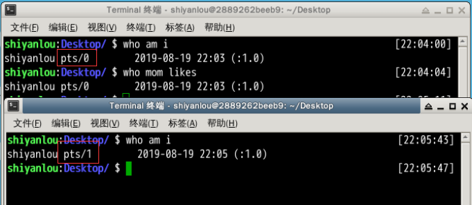
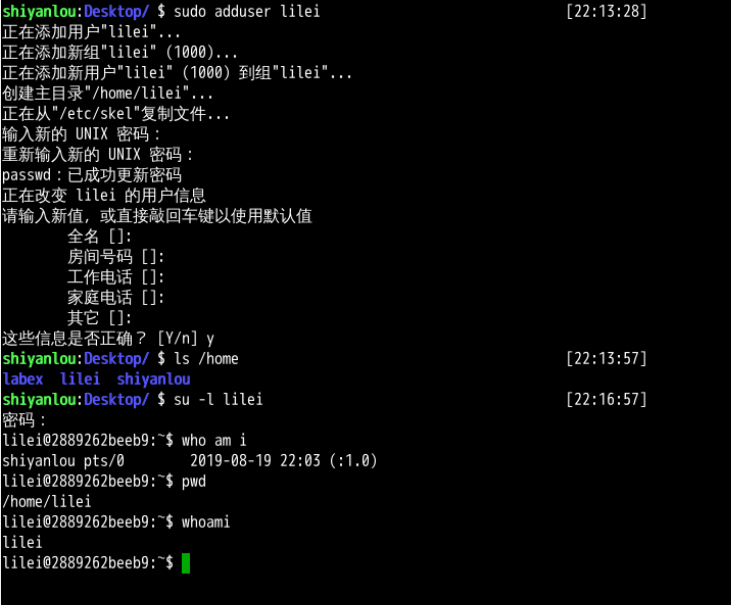
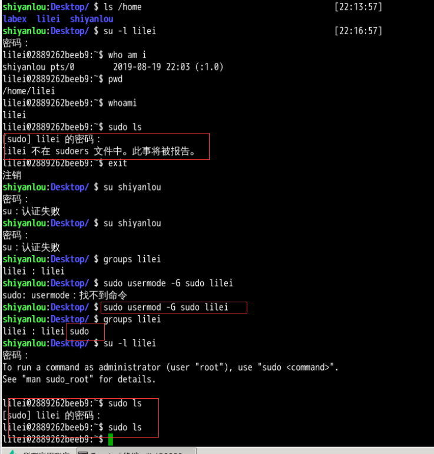
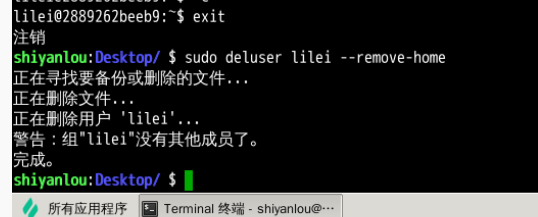

# linux 学习

[实验楼](https://www.shiyanlou.com/courses/1)

## 1 用户及文件权限管理

### 1.1 用户管理 创建删除用户/用户组

> Linux 是一个可以实现多用户登录的操作系统，比如“李雷”和“韩梅梅”都可以同时登录同一台主机，他们共享一些主机的资源，但他们也分别有自己的用户空间，用于存放各自的文件。但实际上他们的文件都是放在同一个物理磁盘上的甚至同一个逻辑分区或者目录里，但是由于 Linux 的 用户管理 和 权限机制，不同用户不可以轻易地查看、修改彼此的文件。

#### 1.1.1 查看用户 `who am i` 或者 `who mom likes`
输出的第一列表示打开当前伪终端的用户的用户名（要查看当前登录用户的用户名，去掉空格直接使用 `whoami` 即可），第二列的 `pts/0` 中 `pts` 表示伪终端，所谓伪是相对于 `/dev/tty` 设备而言的，还记得上一节讲终端时的那七个使用 `[Ctrl]+[Alt]+[F1]～[F7] `进行切换的 `/dev/tty` 设备么,这是“真终端”，伪终端就是当你在图形用户界面使用 `/dev/tty7` 时每打开一个终端就会产生一个伪终端， `pts/0` 后面那个数字就表示打开的伪终端序号，你可以尝试再打开一个终端，然后在里面输入 `who am i` ，看第二列是不是就变成 `pts/1` 了，第三列则表示当前伪终端的启动时间。



who 命令其它常用参数

|参数 |说明|
| --- | --- |
|`-a` |打印能打印的全部|
|`-d` |打印死掉的进程|
|`-m` |同am i,mom likes|
|`-q` |打印当前登录用户数及用户名|
|`-u` |打印当前登录用户登录信息|
|`-r` |打印运行等级|

#### 1.1.2 创建用户
在 Linux 系统里， root 账户拥有整个系统至高无上的权利，比如 新建/添加 用户。

> root 权限，系统权限的一种，与 SYSTEM 权限可以理解成一个概念，但高于 Administrator 权限，root 是 Linux 和 UNIX 系统中的超级管理员用户帐户，该帐户拥有整个系统至高无上的权力，所有对象他都可以操作，所以很多黑客在入侵系统的时候，都要把权限提升到 root 权限，用 Windows 的方法理解也就是将自己的非法帐户添加到 Administrators 用户组。更比如安卓操作系统中（基于 Linux 内核）获得 root 权限之后就意味着已经获得了手机的最高权限，这时候你可以对手机中的任何文件（包括系统文件）执行所有增、删、改、查的操作。

我们一般登录系统时都是以普通账户的身份登录的，要创建用户需要 root 权限，这里就要用到 sudo 这个命令了。不过使用这个命令有两个大前提，一是你要知道当前登录用户的密码，二是当前用户必须在 sudo 用户组。shiyanlou 用户也属于 sudo 用户组（稍后会介绍如何查看和添加用户组）。

**su，su- 与 sudo**
**需要注意 Linux 环境下输入密码是不会显示的。**

`su <user>` 可以切换到用户 user，执行时需要输入目标用户的密码，`sudo <cmd>` 可以以特权级别运行 cmd 命令，需要当前用户属于 sudo 组，且需要输入当前用户的密码。`su - <user>` 命令也是切换用户，同时环境变量也会跟着改变成目标用户的环境变量。

现在我们新建一个叫 lilei 的用户：

```shell
$ sudo adduser lilei
```

这个命令不但可以添加用户到系统，同时也会默认为新用户创建 home 目录：

```shell
$ ls /home
```

现在你已经创建好一个用户，并且你可以使用你创建的用户登录了，使用如下命令切换登录用户：

```shell
$ su -l lilei
```

输入刚刚设置的 lilei 的密码，然后输入如下命令并查看输出：

```shell
$ who am i
$ whoami
$ pwd
```

退出当前用户跟退出终端一样可以使用 exit 命令或者使用快捷键 `Ctrl+d`。



#### 1.1.3 用户组

在 Linux 里面每个用户都有一个归属（用户组），用户组简单地理解就是一组用户的集合，它们共享一些资源和权限，同时拥有私有资源，就跟家的形式差不多，你的兄弟姐妹（不同的用户）属于同一个家（用户组），你们可以共同拥有这个家（共享资源），爸妈对待你们都一样（共享权限），你偶尔写写日记，其他人未经允许不能查看（私有资源和权限）。当然一个用户是可以属于多个用户组的，正如你既属于家庭，又属于学校或公司。

在 Linux 里面如何知道自己属于哪些用户组呢？

方法一：使用 groups 命令

```shell
$ groups shiyanlou
```

方法二：查看 `/etc/group` 文件

```shell
$ cat /etc/group | sort
```

这里 `cat` 命令用于读取指定文件的内容并打印到终端输出，后面会详细讲它的使用。 `| sort` 表示将读取的文本进行一个字典排序再输出，然后你将看到如下一堆输出，你可以在最下面看到 `shiyanlou` 的用户组信息

没找到，没关系，你可以使用命令过滤掉一些你不想看到的结果：

```shell
$ cat /etc/group | grep -E "shiyanlou"
```

/etc/group 文件格式说明
/etc/group 的内容包括用户组（Group）、用户组口令、GID 及该用户组所包含的用户（User），每个用户组一条记录。格式如下：
```
group_name:password:GID:user_list
```
你看到上面的 password 字段为一个 x 并不是说密码就是它，只是表示密码不可见而已。

这里需要注意，如果用户的 GID 等于用户组的 GID，那么最后一个字段 user_list 就是空的，比如 shiyanlou 用户，在 `/etc/group` 中的 shiyanlou 用户组后面是不会显示的。lilei 用户，在 `/etc/group` 中的 lilei 用户组后面是不会显示的。

**将其它用户加入 sudo 用户组**

默认情况下新创建的用户是不具有 root 权限的，也不在 sudo 用户组，可以让其加入 sudo 用户组从而获取 root 权限：

```shell
# 注意 Linux 上输入密码是不会显示的
$ su -l lilei
$ sudo ls
```

会提示 lilei 不在 sudoers 文件中，意思就是 lilei 不在 sudo 用户组中，至于 sudoers 文件（`/etc/sudoers`）你现在最好不要动它，操作不慎会导致比较麻烦的后果。

使用 `usermod` 命令可以为用户添加用户组，同样使用该命令你必需有 root 权限，你可以直接使用 root 用户为其它用户添加用户组，或者用其它已经在 sudo 用户组的用户使用 sudo 命令获取权限来执行该命令。

这里我用 shiyanlou 用户执行 sudo 命令将 lilei 添加到 sudo 用户组，让它也可以使用 sudo 命令获得 root 权限：

``` shell
$ su shiyanlou # 此处需要输入 shiyanlou 用户密码，shiyanlou 的密码可以通过 `sudo passwd shiyanlou` 进行设置。
$ groups lilei
$ sudo usermod -G sudo lilei
$ groups lilei
```

然后你再切换回 lilei 用户，现在就可以使用 sudo 获取 root 权限了。



#### 1.1.4 删除用户

```shell
$ sudo deluser lilei --remove-home
```



### 1.2 权限管理 文件权限设置
#### 1.2.1 查看文件权限
#### 1.2.2 变更文件所有者
#### 1.2.3 修改文件权限