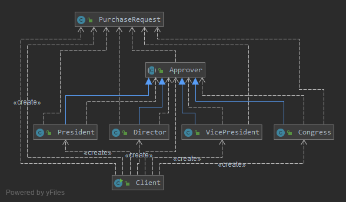

# 请求的链式处理 职责链模式(Chain of Responsibility Pattern)

> 职责链可以是一条直线、一个环或者一个树形结构，最常见的职责链是直线型，即沿着一条单向的链来传递请求。
链上的每一个对象都是请求处理者，职责链模式可以将请求的处理者组织成一条链，并让请求沿着链传递，
由链上的处理者对请求进行相应的处理，客户端无须关心请求的处理细节以及请求的传递，
只需将请求发送到链上即可，实现请求发送者和请求处理者解耦。

职责链模式定义如下：

> 职责链模式(Chain of Responsibility Pattern)：避免请求发送者与接收者耦合在一起，
让多个对象都有可能接收请求，将这些对象连接成一条链，并且沿着这条链传递请求，直到有对象处理它为止。
职责链模式是一种对象行为型模式。

## v0 采购单的分级审批的初始解决方案

根据采购金额的不同由不同层次的主管人员来审批
- 主任可以审批5万元以下（不包括5万元）的采购单
- 副董事长可以审批5万元至10万元（不包括10万元）的采购单
- 董事长可以审批10万元至50万元（不包括50万元）的采购单
- 50万元及以上的采购单就需要开董事会讨论决定

```java
//采购单处理类
class PurchaseRequestHandler {
    //递交采购单给主任
    public void sendRequestToDirector(PurchaseRequest request) {
        if (request.getAmount() < 50000) {
            //主任可审批该采购单
            this.handleByDirector(request);
        } else if (request.getAmount() < 100000) {
            //副董事长可审批该采购单
            this.handleByVicePresident(request);
        } else if (request.getAmount() < 500000) {
            //董事长可审批该采购单
            this.handleByPresident(request);
        } else {
            //董事会可审批该采购单
            this.handleByCongress(request);
        }
    }
    //主任审批采购单
    public void handleByDirector(PurchaseRequest request) {
        //代码省略
    }
    //副董事长审批采购单
    public void handleByVicePresident(PurchaseRequest request) {
        //代码省略
    }
    //董事长审批采购单
    public void handleByPresident(PurchaseRequest request) {
        //代码省略
    }
    //董事会审批采购单
    public void handleByCongress(PurchaseRequest request) {
        //代码省略
    }
}
```

存在几个问题
1. PurchaseRequestHandler类较为庞大，各个级别的审批方法都集中在一个类中，违反了单一职责原则
2. 增加或者删除一个审批级别需要对源代码进行修改, 违反开闭原则
3. 审批流程的设置缺乏灵活性, 客户端无法定制审批流程

## v1 责任链模式简单实现

```java
abstract class Handler {
    //维持对下家的引用
    protected Handler successor;
    public void setSuccessor(Handler successor) {
        this.successor=successor;
    }
    public abstract void handleRequest(String request);
}

class ConcreteHandler extends Handler {
    public void handleRequest(String request) {
        if (请求满足条件) {
            //处理请求
        }
        else {
            this.successor.handleRequest(request); //转发请求
        }
    }
}
```

- Handler抽象处理者
    > 它定义了一个处理请求的接口，一般设计为抽象类，由于不同的具体处理者处理请求的方式不同，因此在其中定义了抽象请求处理方法。
    因为每一个处理者的下家还是一个处理者，因此在抽象处理者中定义了一个抽象处理者类型的对象，作为其对下家的引用。
    通过该引用，处理者可以连成一条链。
- ConcreteHandler具体处理者
    > 它是抽象处理者的子类，可以处理用户请求，在具体处理者类中实现了抽象处理者中定义的抽象请求处理方法，
    在处理请求之前需要进行判断，看是否有相应的处理权限，如果可以处理请求就处理它，否则将请求转发给后继者；
    在具体处理者中可以访问链中下一个对象，以便请求的转发。
    1. 处理请求，不同的具体处理者以不同的形式实现抽象请求处理方法handleRequest()
    2. 转发请求，如果该请求超出了当前处理者类的权限，可以将该请求转发给下家。

职责链模式并不创建职责链, 职责链的创建工作必须由系统的其他部分来完成

## [v2 使用职责链模式实现采购单的分级审批](v2)



- 抽象类Approver充当抽象处理者（抽象传递者）
- Director, VicePresident, President和Congress充当具体处理者（具体传递者）
- PurchaseRequest充当请求类

如果需要在系统增加一个新的具体处理者，如增加一个经理(Manager)角色可以审批5万元至8万元（不包括8万元）的采购单，
需要编写一个新的具体处理者类Manager，作为抽象处理者类Approver的子类，
实现在Approver类中定义的抽象处理方法，如果采购金额大于等于8万元，则将请求转发给下家


```java
class Manager extends Approver{}
```

由于链的创建过程由客户端负责，因此增加新的具体处理者类对原有类库无任何影响，无须修改已有类的源代码，符合“开闭原则”。

```java
Approver rhuang = new Manager("黄蓉");

//创建职责链
wjzhang.setSuccessor(rhuang); //将“黄蓉”作为“张无忌”的下家
rhuang.setSuccessor(gyang); //将“杨过”作为“黄蓉”的下家
gyang.setSuccessor(jguo);
jguo.setSuccessor(meeting);
```

## 纯与不纯的职责链模式

1. 纯的职责链模式
    > 一个纯的职责链模式要求一个具体处理者对象只能在两个行为中选择一个：要么承担全部责任，要么将责任推给下家，
    **不允许出现某一个具体处理者对象在承担了一部分或全部责任后又将责任向下传递的情况**。
    而且在纯的职责链模式中，要求一个请求必须被某一个处理者对象所接收，不能出现某个请求未被任何一个处理者对象处理的情况。
    在前面的采购单审批实例中应用的是纯的职责链模式。
2. 不纯的职责链模式
    > 在一个不纯的职责链模式中允许某个请求被一个具体处理者部分处理后再向下传递，
    或者一个具体处理者处理完某请求后其后继处理者可以继续处理该请求，而且一个请求可以最终不被任何处理者对象所接收。

## 总结

1. 优点
    1. 职责链模式使得一个对象无须知道是其他哪一个对象处理其请求，对象仅需知道该请求会被处理即可，
    接收者和发送者都没有对方的明确信息，且链中的对象不需要知道链的结构，由客户端负责链的创建，降低了系统的耦合度。
    2. 请求处理对象仅需维持一个指向其后继者的引用，而不需要维持它对所有的候选处理者的引用，可简化对象的相互连接。
    3. 在给对象分派职责时，职责链可以给我们更多的灵活性，
    可以通过在运行时对该链进行动态的增加或修改来增加或改变处理一个请求的职责。
    4. 在系统中增加一个新的具体请求处理者时无须修改原有系统的代码，只需要在客户端重新建链即可，从这一点来看是符合“开闭原则”的。
2.缺点
    1. 由于一个请求没有明确的接收者，那么就不能保证它一定会被处理，该请求可能一直到链的末端都得不到处理；
    一个请求也可能因职责链没有被正确配置而得不到处理。
    2. 对于比较长的职责链，请求的处理可能涉及到多个处理对象，系统性能将受到一定影响，而且在进行代码调试时不太方便。
    3. 如果建链不当，可能会造成循环调用，将导致系统陷入死循环。

## 使用

- java.util.logging.Logger#log()
- [javax.servlet.Filter#doFilter()](https://docs.oracle.com/javaee/7/api/javax/servlet/Filter.html#doFilter-javax.servlet.ServletRequest-javax.servlet.ServletResponse-javax.servlet.FilterChain-)