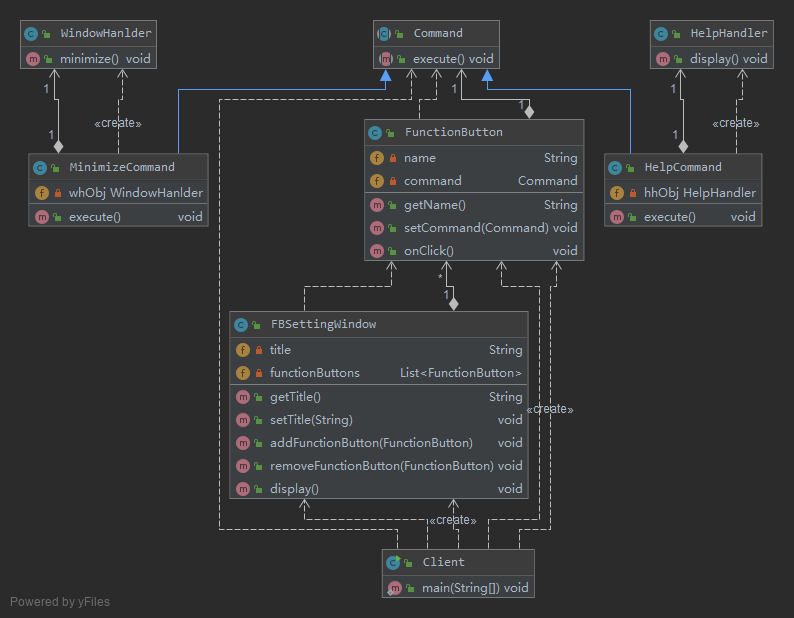
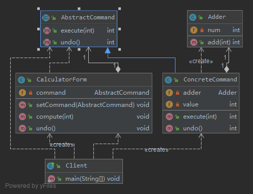
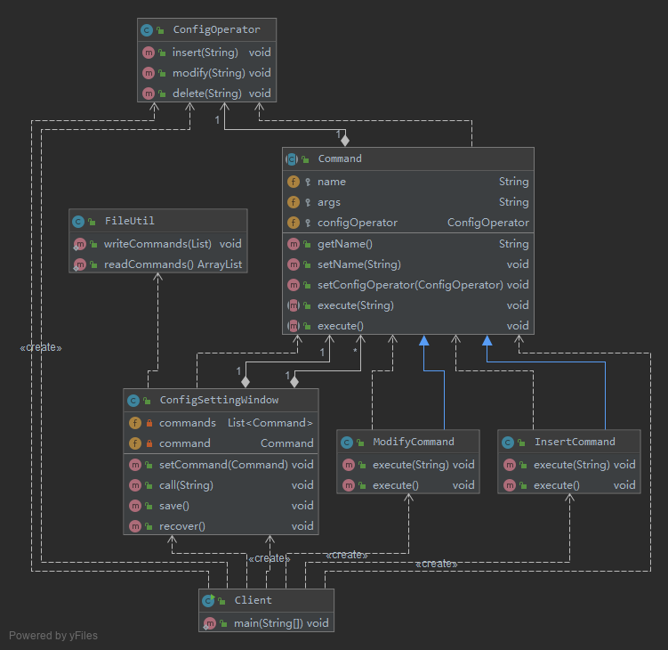

# 请求发送者与接收者解耦——命令模式(Command Pattern)

命令模式可以将请求发送者和接收者完全解耦，发送者与接收者之间没有直接引用关系，
发送请求的对象只需要知道如何发送请求，而不必知道如何完成请求。

命令模式定义如下：

> 命令模式(Command Pattern)：将一个请求封装为一个对象，从而让我们可用不同的请求对客户进行参数化；
对请求排队或者记录请求日志，以及支持可撤销的操作。命令模式是一种对象行为型模式，
其别名为动作(Action)模式或事务(Transaction)模式。

命令模式的定义比较复杂，提到了很多术语，例如“用不同的请求对客户进行参数化”、“对请
求排队”，“记录请求日志”、“支持可撤销操作”等

## v0 基本实现

```java
abstract class Command {
    public abstract void execute();
}
class Invoker {
    private Command command;
        //构造注入
        public Invoker(Command command) {
        this.command = command;
    }
    //设值注入
    public void setCommand(Command command) {
        this.command = command;
    }
    //业务方法，用于调用命令类的execute()方法
    public void call() {
        command.execute();
    }
}
class ConcreteCommand extends Command {
    private Receiver receiver; //维持一个对请求接收者对象的引用
    public void execute() {
        receiver.action(); //调用请求接收者的业务处理方法action()
    }
}
class Receiver {
    public void action() {
        //具体操作
    }
}
```

- Command（抽象命令类）：抽象命令类一般是一个抽象类或接口，在其中声明了用于执行请求的execute()等方法，
通过这些方法可以调用请求接收者的相关操作。
- ConcreteCommand（具体命令类）：具体命令类是抽象命令类的子类，实现了在抽象命令类中声明的方法，
它对应具体的接收者对象，将接收者对象的动作绑定其中。在实现execute()方法时，将调用接收者对象的相关操作(Action)。
- Invoker（调用者）：调用者即请求发送者，它通过命令对象来执行请求。
一个调用者并不需要在设计时确定其接收者，因此它只与抽象命令类之间存在关联关系。
在程序运行时可以将一个具体命令对象注入其中，再调用具体命令对象的execute()方法，
从而实现间接调用请求接收者的相关操作。
- Receiver（接收者）：接收者执行与请求相关的操作，它具体实现对请求的业务处理。

命令模式的关键在于引入了抽象命令类，请求发送者针对抽象命令类编程，只有实现了抽象命令类的具体命令才与请求接收者相关联。

## [v1 使用命令模式来设计 _自定义功能键设置_](v1)

用户可以将功能键和相应功能绑定在一起，还可以根据需要来修改功能键的设置，而且系统在未来可能还会增加一些新的功能或功能键



- FBSettingWindow是*功能键设置*界面类
- FunctionButton充当请求调用者
- Command充当抽象命令类
    - MinimizeCommand和HelpCommand充当具体命令类
- WindowHandler和HelpHandler充当请求接收者
- 配置文件config.xml中存储了具体建造者类的类名
    如果需要修改功能键的功能，例如某个功能键可以实现“自动截屏”，只需要对应增加一个新的具体命令类，
    在该命令类与屏幕处理者(ScreenHandler)之间创建一个关联关系，然后将该具体命令类的对象通过配置文件注入到某个功能键即可，
    原有代码无须修改，符合“开闭原则”。

## v2 命令队列的实现

有时候我们需要将多个请求排队，当一个请求发送者发送一个请求时，将不止一个请求接收者产生响应，
这些请求接收者将逐个执行业务方法，完成对请求的处理。此时，可以通过命令队列来实现

命令队列的实现方法有多种形式，其中最常用、灵活性最好的一种方式是增加一个`CommandQueue`类，
由该类来负责存储多个命令对象，而不同的命令对象可以对应不同的请求接收者

```java
class CommandQueue {
    //定义一个ArrayList来存储命令队列
    private List<Command> commands = new ArrayList<Command>();
    public void addCommand(Command command) {
        commands.add(command);
    }
    public void removeCommand(Command command) {
        commands.remove(command);
    }
    //循环调用每一个命令对象的execute()方法
    public void execute() {
        for (Object command : commands) {
            ((Command)command).execute();
        }
    }
}
class Invoker {
    private CommandQueue commandQueue; //维持一个CommandQueue对象的引用
    //构造注入
    public Invoker(CommandQueue commandQueue) {
        this. commandQueue = commandQueue;
    }
    //设值注入
    public void setCommandQueue(CommandQueue commandQueue) {
        this.commandQueue = commandQueue;
    }
    //调用CommandQueue类的execute()方法
    public void call() {
        commandQueue.execute();
    }
}
```

如果请求接收者的接收次序没有严格的先后次序，我们还可以使用多线程技术来并发调用命令对象的`execute()`方法，从而提高程序的执行效率。

## v3 撤销操作的实现 -- 简易计算器(可以对运算实施撤销操作)

在命令模式中，我们可以通过调用一个命令对象的`execute()`方法来实现对请求的处理，
如果需要撤销(Undo)请求，可通过在命令类中增加一个逆向操作来实现。

除了通过一个逆向操作来实现撤销(Undo)外，还可以通过保存对象的历史状态来实现撤销，
后者可使用备忘录模式(Memento Pattern)来实现。



计算器界面类CalculatorForm充当请求发送者，实现了数据求和功能的加法类Adder充当请求接收者，界面类
可间接调用加法类中的add()方法实现加法运算，并且提供了可撤销加法运算的undo()方法。

> 需要注意的是在本实例中只能实现一步撤销操作，因为没有保存命令对象的历史状态，
可以通过引入一个命令集合或其他方式来存储每一次操作时命令的状态，从而实现多次撤销操作。除了Undo操作外，
还可以采用类似的方式实现恢复(Redo)操作，即恢复所撤销的操作（或称为二次撤销）。

## v4 请求日志

请求日志就是将请求的历史记录保存下来，通常以日志文件(Log File)的形式永久存储在计算机中。



在实现请求日志时，我们可以将命令对象通过序列化写到日志文件中，此时命令类必须实现`Java.io.Serializable`接口。

**网站配置文件管理工具**, 希望将对配置文件的操作请求记录在日志文件中，如果网站重新部署，
只需要执行保存在日志文件中的命令对象即可修改配置文件。

## v5 宏命令

> 宏命令(Macro Command)又称为组合命令，它是组合模式和命令模式联用的产物。

> 宏命令是一个具体命令类，它拥有一个集合属性，在该集合中包含了对其他命令对象的引用。
通常宏命令不直接与请求接收者交互，而是通过它的成员来调用接收者的方法。
当调用宏命令的execute()方法时，将递归调用它所包含的每个成员命令的execute()方法，
一个宏命令的成员可以是简单命令，还可以继续是宏命令。
执行一个宏命令将触发多个具体命令的执行，从而实现对命令的批处理

## 总结

1. 优点
    1. 降低系统的耦合度。由于请求者与接收者之间不存在直接引用，因此请求者与接收者之间实现完全解耦，
    相同的请求者可以对应不同的接收者，同样，相同的接收者也可以供不同的请求者使用，两者之间具有良好的独立性。
    2. 新的命令可以很容易地加入到系统中。由于增加新的具体命令类不会影响到其他类，因此增加新的具体命令类很容易，
    无须修改原有系统源代码，甚至客户类代码，满足“开闭原则”的要求。
    3. 可以比较容易地设计一个命令队列或宏命令（组合命令）。
    4. 为请求的撤销(Undo)和恢复(Redo)操作提供了一种设计和实现方案。
1. 缺点
    1. 使用命令模式可能会导致某些系统有过多的具体命令类。
        因为针对每一个对请求接收者的调用操作都需要设计一个具体命令类，
        因此在某些系统中可能需要提供大量的具体命令类，这将影响命令模式的使用。

## 使用

- `java.lang.Runnable`
- `javax.swing.Action`