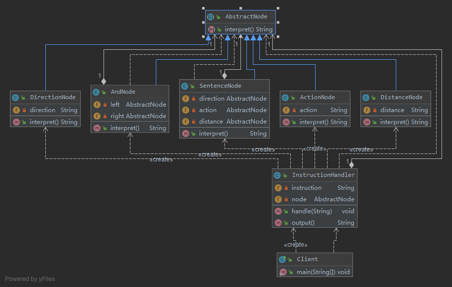
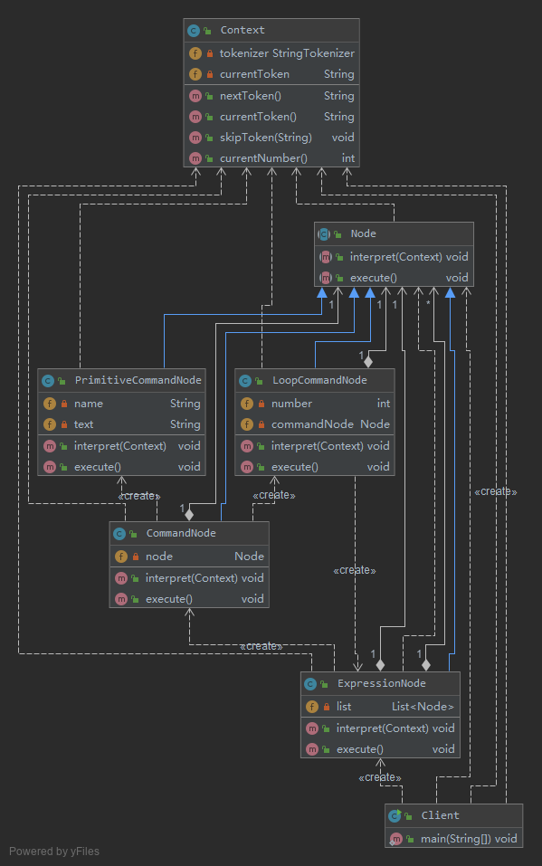

# 自定义语言的实现 解释器模式-Interpreter Pattern

解释器模式是一种使用频率相对较低但学习难度较大的设计模式，
它用于描述如何使用面向对象语言构成一个简单的语言解释器。
在某些情况下，为了更好地描述某一些特定类型的问题，我们可以创建一种新的语言，
这种语言拥有自己的表达式和结构，即文法规则，这些问题的实例将对应为该语言中的句子。
此时，可以使用解释器模式来设计这种新的语言。

定义如下： 
> 解释器模式(Interpreter Pattern)：定义一个语言的文法，并且建立一个解释器来解释该语言中的句子，
这里的“语言”是指使用规定格式和语法的代码。解释器模式是一种类行为型模式。

## v0 简单实现

```java
abstract class AbstractExpression {
    public abstract void interpret(Context ctx);
}

class TerminalExpression extends AbstractExpression {
    // 对于终结符表达式，其代码很简单，主要是对终结符元素的处理
    public void interpret(Context ctx) {
        //终结符表达式的解释操作
    }
}

class NonterminalExpression extends AbstractExpression {
    // 对于非终结符表达式，其代码相对比较复杂，
    // 因为可以通过非终结符将表达式组合成更加复杂的结构
    // 对于包含两个操作元素的非终结符表达式类
    private AbstractExpression left;
    private AbstractExpression right;
    public NonterminalExpression(AbstractExpression left,AbstractExpression right) {
        this.left=left;
        this.right=right;
    }
    public void interpret(Context ctx) {
        //递归调用每一个组成部分的interpret()方法
        //在递归调用时指定组成部分的连接方式，即非终结符的功能
    }
}

class Context {
    // 通常在Context中包含了一个HashMap或ArrayList等类型的集合对象（也可
    // 以直接由HashMap等集合类充当环境类），存储一系列公共信息，如变量名与值的映射关系（key/value）等
    // 用于在进行具体的解释操作时从中获取相关信息。
    private HashMap map = new HashMap();
    public void assign(String key, String value) {
        //往环境类中设值
    }
    public String lookup(String key) {
        //获取存储在环境类中的值
    }
}
```

- AbstractExpression（抽象表达式）：在抽象表达式中声明了抽象的解释操作，它是所有终结符表达式和非终结符表达式的公共父类。
- TerminalExpression（终结符表达式）：终结符表达式是抽象表达式的子类，
它实现了与文法中的终结符相关联的解释操作，在句子中的每一个终结符都是该类的一个实例。
通常在一个解释器模式中只有少数几个终结符表达式类，它们的实例可以通过非终结符表达式组成较为复杂的句子。
- NonterminalExpression（非终结符表达式）：非终结符表达式也是抽象表达式的子类，
它实现了文法中非终结符的解释操作，由于在非终结符表达式中可以包含终结符表达式，
也可以继续包含非终结符表达式，因此其解释操作一般通过递归的方式来完成。
- Context（环境类）：环境类又称为上下文类，它用于存储解释器之外的一些全局信息，
通常它临时存储了需要解释的语句。


## [v1 机器人控制程序](v1)

该机器人控制程序中包含一些简单的英文控制指令
- 每一个指令对应一个表达式(expression)，该表达式可以是简单表达式也可以是复合表达式
- 每一个简单表达式由移动方向(direction)，移动方式(action)和移动距离(distance)三部分组成
- 其中移动方向包括上(up)、下(down)、左(left)、右(right)
- 移动方式包括移动(move)和快速移动(run)
- 移动距离为一个正整数。
- 两个表达式之间可以通过与(and)连接，形成复合(composite)表达式。

针对五条文法规则，分别提供五个类来实现，
其中终结符表达式direction、action和distance对应DirectionNode类、ActionNode类和DistanceNode类，
非终结符表达式expression和composite对应SentenceNode类和AndNode类。



- AbstractNode充当抽象表达式角色
- DirectionNode、ActionNode和DistanceNode充当终结符表达式角色
- AndNode和SentenceNode充当非终结符表达式角色
- 工具类InstructionHandler用于对输入指令进行处理，
    >  将输入指令分割为字符串数组，将第1个、第2个和第3个单词组合成一个句子，并存入栈中。
    如果发现有单词“and”，则将“and”后的第1个、第2个和第3个单词组合成一个新的句子作为“and”的右表达式，
    并从栈中取出原先所存句子作为左表达式，然后组合成一个And节点存入栈中。依此类推，直到整个指令解析结束。

## [v2 Context的作用](v2)

> 在解释器模式中，环境类Context用于存储解释器之外的一些全局信息，
它通常作为参数被传递到所有表达式的解释方法interpret()中，可以在Context对象中存储和访问表达式解释器的状态，
向表达式解释器提供一些全局的、公共的数据，此外还可以在Context中增加一些所有表达式解释器都共有的功能，减轻解释器的职责。

```
输入:

LOOP 2 PRINT杨过 SPACE SPACE PRINT 小龙女 BREAK END PRINT郭靖 SPACE SPACE PRINT 黄蓉

输出:

杨过 小龙女
杨过 小龙女
郭靖 黄蓉
```
- 其中关键词LOOP表示“循环”
- 后面的数字表示循环次数PRINT表示“打印”
- 后面的字符串表示打印的内容
- SPACE表示“空格”
- BREAK表示“换行”
- END表示“循环结束”

每一个关键词对应一条命令，计算机程序将根据关键词执行相应的处理操作。



- Context充当环境角色
    - 环境类：用于存储和操作需要解释的语句，在本实例中每一个需要解释的单词可以称为一个动作标记(Action Token)或命令
    - 环境类Context类似一个工具类，它提供了用于处理指令的方法，如`nextToken()、currentToken()、skipToken()`等，
    同时它存储了需要解释的指令并记录了每一次解释的当前标记(Token)，
    而具体的解释过程交给表达式解释器类来处理。我们还可以将各种解释器类包含的公共方法移至环境类中，
    更好地实现这些方法的重用和扩展。
- Node充当抽象表达式角色
    抽象节点类：抽象表达式
- ExpressionNode、CommandNode和LoopCommandNode充当非终结符表达式角色
    - ExpressionNode 表达式节点类：非终结符表达式
    - CommandNode 语句命令节点类：非终结符表达式
    - LoopCommandNode 循环命令节点类：非终结符表达式
- PrimitiveCommandNode充当终结符表达式角色
    基本命令节点类：终结符表达式

## 总结

解释器模式的使用频率不是特别高，但是它在正则表达式、XML文档解释等领域还是得到了广泛使用

1. 主要优点
    1. 易于改变和扩展文法。由于在解释器模式中使用类来表示语言的文法规则，因此可以通过继承等机制来改变或扩展文法。
    2. 每一条文法规则都可以表示为一个类，因此可以方便地实现一个简单的语言。
    3. 实现文法较为容易。在抽象语法树中每一个表达式节点类的实现方式都是相似的，这些类的代码编写都不会特别复杂，
    还可以通过一些工具自动生成节点类代码。
    4. 增加新的解释表达式较为方便。
    如果用户需要增加新的解释表达式只需要对应增加一个新的终结符表达式或非终结符表达式类，原有表达式类代码无须修改，符合“开闭原则”。
1. 主要缺点
    1. 对于复杂文法难以维护。在解释器模式中，每一条规则至少需要定义一个类，因此如果一个语言包含太多文法规则，
    类的个数将会急剧增加，导致系统难以管理和维护，此时可以考虑使用语法分析程序等方式来取代解释器模式。
    2. 执行效率较低。由于在解释器模式中使用了大量的循环和递归调用，因此在解释较为复杂的句子时其速度很慢，而且代码的调试过程也比较麻烦。

## 使用

- `java.util.Pattern`
- `java.text.Normalizer`
- `java.text.Format`
- `javax.el.ELResolver`