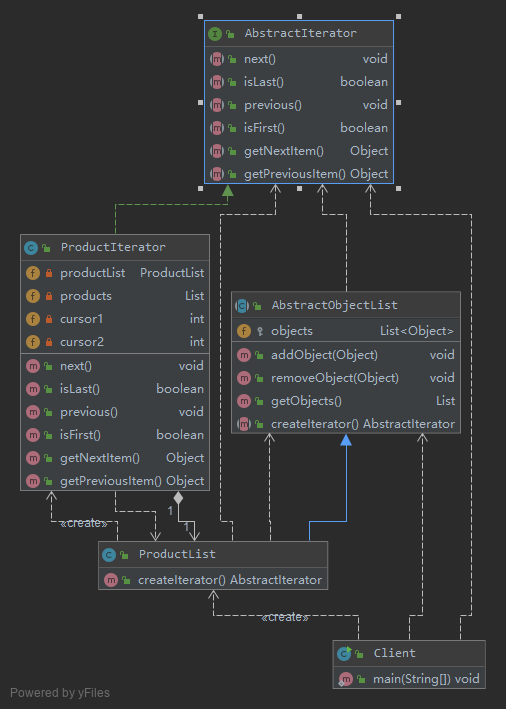
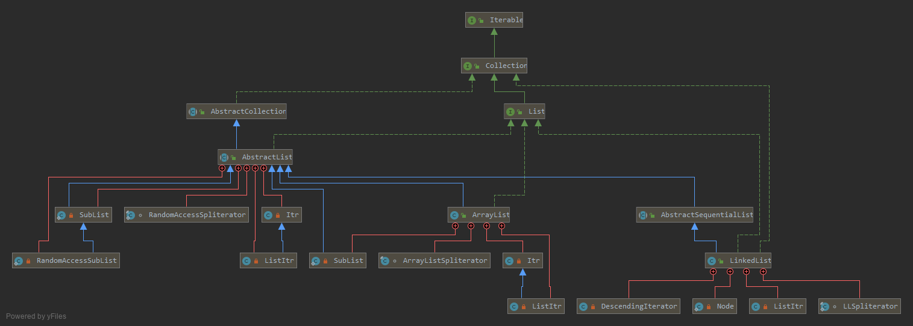

# 遍历聚合对象中的元素——迭代器模式  Iterator Pattern

在软件开发中，我们经常需要使用聚合对象来存储一系列数据。
聚合对象拥有两个职责：一是存储数据；二是遍历数据。从依赖性来看，前者是聚合对象的基本职责；
而后者既是可变化的，又是可分离的。因此，可以将遍历数据的行为从聚合对象中分离出来，
封装在一个被称之为“迭代器”的对象中，由迭代器来提供遍历聚合对象内部数据的行为，
这将简化聚合对象的设计，更符合“单一职责原则”的要求。

迭代器模式定义如下：
> 迭代器模式(Iterator Pattern)：提供一种方法来访问聚合对象，而不用暴露这个对象的内部表示，其别名为游标(Cursor)。

迭代器模式是一种对象行为型模式。

## v0 基本实现

```java
// 在抽象迭代器中声明了用于遍历聚合对象中所存储元素的方法
interface Iterator {
    public void first(); //将游标指向第一个元素
    public void next(); //将游标指向下一个元素
    public boolean hasNext(); //判断是否存在下一个元素
    public Object currentItem(); //获取游标指向的当前元素
}

// 在具体迭代器中将实现抽象迭代器声明的遍历数据的方法
class ConcreteIterator implements Iterator {
    private ConcreteAggregate objects; //维持一个对具体聚合对象的引用，以便于访问存储在聚合对象中的数据
    private int cursor; //定义一个游标，用于记录当前访问位置
    public ConcreteIterator(ConcreteAggregate objects) {
        this.objects=objects;
    }
    public void first() { ...... }
    public void next() { ...... }
    public boolean hasNext() { ...... }
    public Object currentItem() { ...... }
}

// 聚合类用于存储数据并负责创建迭代器对象
interface Aggregate {
    Iterator createIterator();
}

// 具体聚合类作为抽象聚合类的子类，一方面负责存储数据，
// 另一方面实现了在抽象聚合类中声明的工厂方法createIterator()，用于返回一个与该具体聚合类对应的具体迭代器对象
class ConcreteAggregate implements Aggregate {
    ......
    public Iterator createIterator() {
        return new ConcreteIterator(this);
    }
    ......
}
```

- Iterator（抽象迭代器）：它定义了访问和遍历元素的接口，声明了用于遍历数据元素的方法，例如：
    - 用于获取第一个元素的first()方法
    - 用于访问下一个元素的next()方法
    - 用于判断是否还有下一个元素的hasNext()方法
    - 用于获取当前元素的currentItem()方法等
    - 在具体迭代器中将实现这些方法
- ConcreteIterator（具体迭代器）：它实现了抽象迭代器接口，完成对聚合对象的遍历，
同时在具体迭代器中通过游标来记录在聚合对象中所处的当前位置，在具体实现时，游标通常是一个表示位置的非负整数。
- Aggregate（抽象聚合类）：它用于存储和管理元素对象，声明一个createIterator()方法用于创建一个迭代器对象，
充当抽象迭代器工厂角色。
- ConcreteAggregate（具体聚合类）：它实现了在抽象聚合类中声明的createIterator()方法，
该方法返回一个与该具体聚合类对应的具体迭代器ConcreteIterator实例。

## [v1 完整解决方案](v1)

在本实例中，为了详细说明自定义迭代器的实现过程，我们没有使用JDK中内置的迭代器



- `AbstractObjectList`充当抽象聚合类
- `ProductList`充当具体聚合类
- `AbstractIterator`充当抽象迭代器
- `ProductIterator`充当具体迭代器

如果需要增加一个新的具体聚合类，如客户数据集合类，并且需要为客户数据集合类提供不同于商品数据集合类的正向遍历和逆向遍历操作，
只需增加一个新的聚合子类和一个新的具体迭代器类即可，原有类库代码无须修改，符合“开闭原则”

如果需要为ProductList类更换一个迭代器，只需要增加一个新的具体迭代器类作为抽象迭代器类的子类，
重新实现遍历方法，原有迭代器代码无须修改，也符合“开闭原则”

但是如果要在迭代器中增加新的方法，则需要修改抽象迭代器源代码，这将违背“开闭原则”。

## v2 使用内部类实现迭代器

我们可以看到具体迭代器类和具体聚合类之间存在双重关系，其中一个关系为关联关系，
在具体迭代器中需要维持一个对具体聚合对象的引用，
该关联关系的目的是访问存储在聚合对象中的数据，以便迭代器能够对这些数据进行遍历操作。

将迭代器类设计为聚合类的内部类，JDK中的迭代器类就是通过这种方法来实现的

```java
package java.util;
......
public abstract class AbstractList<E> extends AbstractCollection<E> implements List<E> {
    ......
    private class Itr implements Iterator<E> {
        int cursor = 0;
        ......
    }
    ......
}
```

通过类似的方法来设计[**v1**](v1)中的ProductList类，将ProductIterator类作为ProductList类的内部类

```java
//商品数据类：具体聚合类
class ProductList extends AbstractObjectList {
    public ProductList(List products) {
        super(products);
    }

    public AbstractIterator createIterator() {
        return new ProductIterator();
    }

    //商品迭代器：具体迭代器，内部类实现
    private class ProductIterator implements AbstractIterator {
        private int cursor1;
        private int cursor2;

        public ProductIterator() {
            cursor1 = 0;
            cursor2 = objects.size() - 1;
        }

        public void next() {
            if (cursor1 < objects.size()) {
                cursor1++;
            }
        }

        public boolean isLast() {
            return (cursor1 == objects.size());
        }

        public void previous() {
            if (cursor2 > -1) {
                cursor2--;
            }
        }

        public boolean isFirst() {
            return (cursor2 == -1);
        }

        public Object getNextItem() {
            return objects.get(cursor1);
        }

        public Object getPreviousItem() {
            return objects.get(cursor2);
        }
    }
}
```

## JDK内置迭代器

在Java集合框架中，常用的`List`和`Set`等聚合类都继承（或实现）了`java.util.Collection`接口,
在`Collection`接口中声明了如下方法:

```java
package java.util;
public interface Collection<E> extends Iterable<E> {
    .....
    boolean add(Object c);
    boolean addAll(Collection c);
    boolean remove(Object o);
    boolean removeAll(Collection c);
    boolean remainAll(Collection c);
    Iterator iterator();
    ......
}
```

除了包含一些增加元素和删除元素的方法外，还提供了一个iterator()方法，
用于返回一个Iterator迭代器对象，以便遍历聚合中的元素；
具体的Java聚合类可以通过实现该iterator()方法返回一个具体的Iterator对象。

```java
package java.util;
public interface Iterator<E> {
    boolean hasNext();
    E next();
    void remove();
}
```

在JDK中，Collection接口和Iterator接口充当了迭代器模式的抽象层，
分别对应于抽象聚合类和抽象迭代器，而Collection接口的子类充当了具体聚合类，
下面以List为例加以说明，JDK中部分与List有关的类及它们之间的关系:



- `class ListItr extends Itr implements ListIterator<E>`
- `class Itr implements Iterator<E>`
- `interface ListIterator<E> extends Iterator<E>`

在Java中，我们可以直接使用JDK内置的迭代器来遍历聚合对象中的元素：
```java
import java.util.*;
class IteratorDemo {
    public static void process(Collection c) {
        Iterator i = c.iterator(); //创建迭代器对象
        //通过迭代器遍历聚合对象
        while(i.hasNext()) {
            System.out.println(i.next().toString());
        }
    }
    
    public static void main(String args[]) {
        Collection persons;
        persons = new ArrayList(); //创建一个ArrayList类型的聚合对象
        persons.add("张无忌");
        persons.add("小龙女");
        persons.add("令狐冲");
        persons.add("韦小宝");
        persons.add("袁紫衣");
        persons.add("小龙女");
        process(persons);
    }
}
```

## 总结

1. 主要优点
    1. 它支持以不同的方式遍历一个聚合对象，在同一个聚合对象上可以定义多种遍历方式。
    在迭代器模式中只需要用一个不同的迭代器来替换原有迭代器即可改变遍历算法，我们也可以自己定义迭代器的子类以支持新的遍历方式。
    2. 迭代器简化了聚合类。由于引入了迭代器，在原有的聚合对象中不需要再自行提供数据遍历等方法，这样可以简化聚合类的设计。
    3. 在迭代器模式中，由于引入了抽象层，增加新的聚合类和迭代器类都很方便，无须修改原有代码，满足“开闭原则”的要求。
1. 主要缺点
    1. 由于迭代器模式将存储数据和遍历数据的职责分离，增加新的聚合类需要对应增加新的迭代器类，类的个数成对增加，这在一定程度上增加了系统的复杂性。
    2. 抽象迭代器的设计难度较大，需要充分考虑到系统将来的扩展，例如JDK内置迭代器Iterator就无法实现逆向遍历，
    如果需要实现逆向遍历，只能通过其子类ListIterator等来实现，而ListIterator迭代器无法用于操作Set类型的聚合对象。
    在自定义迭代器时，创建一个考虑全面的抽象迭代器并不是件很容易的事情。

## 使用

- `java.util.Iterator`
- `java.util.Enumeration`