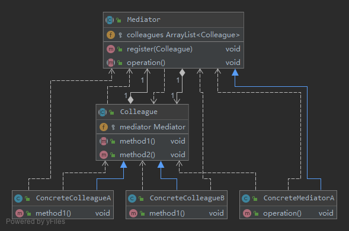
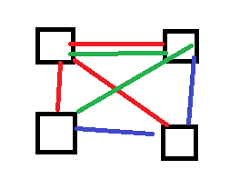
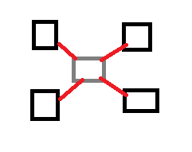
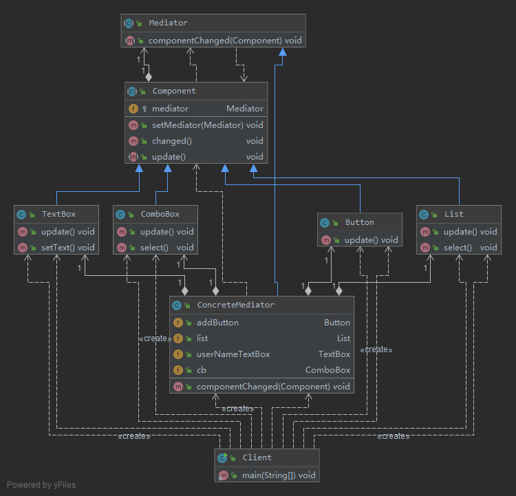
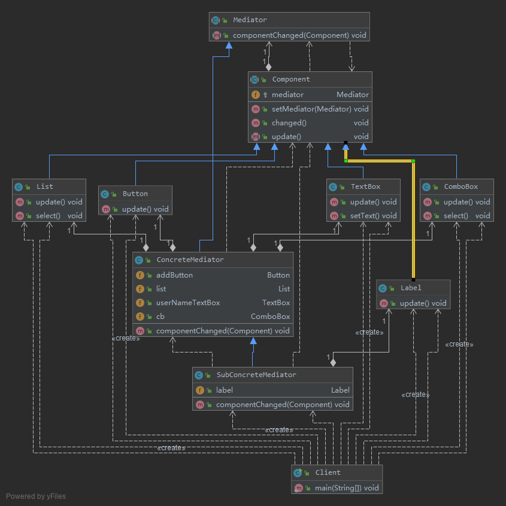

# 协调多个对象之间的交互——中介者模式 (Mediator Pattern)

如果在一个系统中对象之间的联系呈现为网状结构。对象之间存在大量的多对多联系，将导致系统非常复杂，
这些对象既会影响别的对象，也会被别的对象所影响，这些对象称为同事对象，它们之间通过彼此的相互作用实现系统的行为。
在网状结构中，几乎每个对象都需要与其他对象发生相互作用，而这种相互作用表现为一个对象与另外一个对象的直接耦合，
这将导致一个过度耦合的系统。

中介者模式可以使对象之间的关系数量急剧减少，通过引入中介者对象，可以将系统的网状结构变成以中介者为中心的星形结构。

如果在一个系统中对象之间存在多对多的相互关系，我们可以将对象之间的一些交互行为从各个对象中分离出来，
并集中封装在一个中介者对象中，并由该中介者进行统一协调，这样对象之间多对多的复杂关系就转化为相对简单的一对多关系。
通过引入中介者来简化对象之间的复杂交互，中介者模式是“迪米特法则”的一个典型应用。

> 中介者模式(Mediator Pattern)：用一个中介对象（中介者）来封装一系列的对象交互，中介者使各对象不需要显式地相互引用，
从而使其耦合松散，而且可以独立地改变它们之间的交互。中介者模式又称为调停者模式，它是一种对象行为型模式。

# [v0 基本实现](v0)

Mediator（抽象中介者）：它定义一个接口，该接口用于与各同事对象之间进行通信。
- Mediator 中介者类承担了两方面的职责：
    1. 中转作用（结构性）
        > 通过中介者提供的中转作用，各个同事对象就不再需要显式引用其他同事，当需要和其他同事进行通信时，
        可通过中介者来实现间接调用。该中转作用属于中介者在结构上的支持。
    2. 协调作用（行为性）
        > 中介者可以更进一步的对同事之间的关系进行封装，同事可以一致的和中介者进行交互，而不需要指明中介者需要具体怎么做，
        中介者根据封装在自身内部的协调逻辑，对同事的请求进行进一步处理，将同事成员之间的关系行为进行分离和封装。该协调作用属于中介者在行为上的支持。
- ConcreteMediator（具体中介者）
    > 它是抽象中介者的子类，通过协调各个同事对象来实现协作行为，它维持了对各个同事对象的引用。
- Colleague（抽象同事类）
    > 它定义各个同事类公有的方法，并声明了一些抽象方法来供子类实现，同时它维持了一个对抽象中介者类的引用，
    其子类可以通过该引用来与中介者通信。
- ConcreteColleague（具体同事类）
    > 它是抽象同事类的子类；每一个同事对象在需要和其他同事对象通信时，先与中介者通信，通过中介者来间接完成与其他同事类的通信；
    在具体同事类中实现了在抽象同事类中声明的抽象方法。

# [v1 协调界面组件对象之间的复杂交互关系](v1)

未使用中介者模式

使用中介者模式

类结构图

- `Component`充当抽象同事类
- `Button`、`List`、`ComboBox`和`TextBox`充当具体同事类
- `Mediator`充当抽象中介者类
- `ConcreteMediator`充当具体中介者类
- `ConcreteMediator`维持了对具体同事类的引用，为了简化`ConcreteMediator`类的代码，
    我们在其中只定义了一个`Button`对象和一个`TextBox`对象

# [v2 增加一个文本标签(Label)](v2)

首先增加一个`Label`类，但不修改原有具体中介者类`ConcreteMediator`的代码，
而是增加一个`ConcreteMediator`的子类`SubConcreteMediator`来实现对`Label`对象的引用，
然后在新增的中介者类`SubConcreteMediator`中通过覆盖`componentChanged()`方法来实现所有组件（包括新增Label组件）之间的交互，
同样，原有组件类无须做任何修改，[客户端代码](v2/Client.java)需少许修改。

## 总结 

1. 主要优点
    1. 中介者模式简化了对象之间的交互，它用中介者和同事的一对多交互代替了原来同事之间的多对多交互，
    一对多关系更容易理解、维护和扩展，将原本难以理解的网状结构转换成相对简单的星型结构。
    2. 中介者模式可将各同事对象解耦。中介者有利于各同事之间的松耦合，我们可以独立的改变和复用每一个同事和中介者，
    增加新的中介者和新的同事类都比较方便，更好地符合“开闭原则”。
    3. 可以减少子类生成，中介者将原本分布于多个对象间的行为集中在一起，改变这些行为只需生成新的中介者子类即可，
    这使各个同事类可被重用，无须对同事类进行扩展。
2. 主要缺点
    1. 在具体中介者类中包含了大量同事之间的交互细节，可能会导致具体中介者类非常复杂，使得系统难以维护。

## 使用

- `java.util.Timer (所有scheduleXXX()方法)`
- `java.util.concurrent.Executor#execute()`
- `java.util.concurrent.ExecutorService (invokeXXX()和submit()方法)`
- `java.util.concurrent.ScheduledExecutorService (所有scheduleXXX()方法)`
- `java.lang.reflect.Method#invoke()`