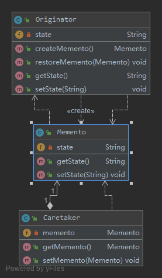
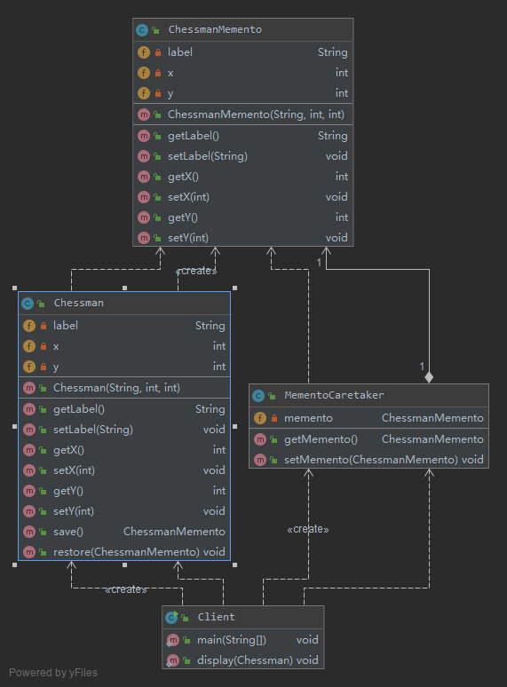
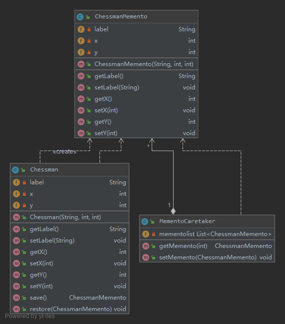

# 撤销功能的实现——备忘录模式 (Memento Pattern)

备忘录模式提供了一种状态恢复的实现机制，使得用户可以方便地回到一个特定的历史步骤，当新的状态无效或者存在问题时，
可以使用暂时存储起来的备忘录将状态复原，当前很多软件都提供了撤销(Undo)操作，其中就使用了备忘录模式。

备忘录模式定义如下：
> 备忘录模式(Memento Pattern)：在不破坏封装的前提下，捕获一个对象的内部状态，
并在该对象之外保存这个状态，这样可以在以后将对象恢复到原先保存的状态。它是一种对象行为型模式，其别名为Token。

备忘录模式的核心是备忘录类以及用于管理备忘录的负责人类的设计

## [v0 简单实现](v0)

- Originator（原发器）
    > 它是一个普通类，可以创建一个备忘录，并存储它的当前内部状态，也可以使用备忘录来恢复其内部状态，
    一般将需要保存内部状态的类设计为原发器。
    - 在设计备忘录类时需要考虑其封装性
        除了Originator类，不允许其他类来调用备忘录类Memento的构造函数与相关方法，如果不考虑封装性，
        允许其他类调用setState()等方法，将导致在备忘录中保存的历史状态发生改变，
        通过撤销操作所恢复的状态就不再是真实的历史状态，备忘录模式也就失去了本身的意义。
    - 在使用Java语言实现备忘录模式时，一般通过将Memento类与Originator类定义在同一个包
      (package)中来实现封装，在Java语言中可使用默认访问标识符来定义Memento类，即保证其包
      内可见。只有Originator类可以对Memento进行访问，而限制了其他类对Memento的访问。在
      Memento中保存了Originator的state值，如果Originator中的state值改变之后需撤销，可以通过调
      用它的restoreMemento()方法进行恢复。
- Memento（备忘录)
    > 存储原发器的内部状态，根据原发器来决定保存哪些内部状态。备忘录的设计一般可以参考原发器的设计，
    根据实际需要确定备忘录类中的属性。需要注意的是，除了原发器本身与负责人类之外，备忘录对象不能直接供其他类使用，
    原发器的设计在不同的编程语言中实现机制会有所不同。
- Caretaker（负责人）
    > 负责人又称为管理者，它负责保存备忘录，但是不能对备忘录的内容进行操作或检查。
    在负责人类中可以存储一个或多个备忘录对象，它只负责存储对象，而不能修改对象，也无须知道对象的实现细节。
    
理解备忘录模式并不难，但关键在于如何设计备忘录类和负责人类。由于在备忘录中存储的是原发器的中间状态，
因此需要防止原发器以外的其他对象访问备忘录，特别是不允许其他对象来修改备忘录。

## [v1 使用备忘录模式来设计中国象棋软件](v1)

- `Chessman`充当原发器
- `ChessmanMemento`充当备忘录
- `MementoCaretaker`充当负责人
    - 在`MementoCaretaker`中定义了一个`ChessmanMemento`类型的对象，用于存储备忘录。

## [v2 实现多次撤销](v2)

使用上述代码只能实现一次撤销，因为在负责人类中只定义一个备忘录对象来保存状态，
后面保存的状态会将前一次保存的状态覆盖，但有时候用户需要撤销多步操作。

多次撤销的解决方案: 在负责人类中定义一个集合来存储多个备忘录，每个备忘录负责保存一个历史状态，
在撤销时可以对备忘录集合进行逆向遍历，回到一个指定的历史状态，而且还可以对备忘录集合进行正向遍历，实现重做(Redo)操作，
即取消撤销，让对象状态得到恢复。

我们对负责人类MementoCaretaker进行了修改，在其中定义了一个ArrayList类型的集合对象来存储多个备忘录

## 总结

备忘录是一个很特殊的对象，只有原发器对它拥有控制的权力，负责人只负责管理，而其他类无法访问到备忘录，因此我们需要对备忘录进行封装。

为了实现对备忘录对象的封装，需要对备忘录的调用进行控制，对于原发器而言，它可以调用备忘录的所有信息，
允许原发器访问返回到先前状态所需的所有数据；对于负责人而言，只负责备忘录的保存并将备忘录传递给其他对象；
对于其他对象而言，只需要从负责人处取出备忘录对象并将原发器对象的状态恢复，而无须关心备忘录的保存细节。
理想的情况是只允许生成该备忘录的那个原发器访问备忘录的内部状态。

在Java语言中可以将原发器类和备忘录类放在一个包中，让它们之间满足默认的包内可见性，
也可以将备忘录类作为原发器类的内部类，使得只有原发器才可以访问备忘录中的数据，其他对象都无法使用备忘录中的数据。

1.主要优点
1. 它提供了一种状态恢复的实现机制，使得用户可以方便地回到一个特定的历史步骤，当新的状态无效或者存在问题时，
可以使用暂时存储起来的备忘录将状态复原。
2. 备忘录实现了对信息的封装，一个备忘录对象是一种原发器对象状态的表示，不会被其他代码所改动。
备忘录保存了原发器的状态，采用列表、堆栈等集合来存储备忘录对象可以实现多次撤销操作。
2.主要缺点
资源消耗过大，如果需要保存的原发器类的成员变量太多，就不可避免需要占用大量的存储空间，每保存一次对象的状态都需要消耗一定的系统资源。

## 使用

- `java.util.Date`
- `java.io.Serializable`
- `javax.faces.component.StateHolder`