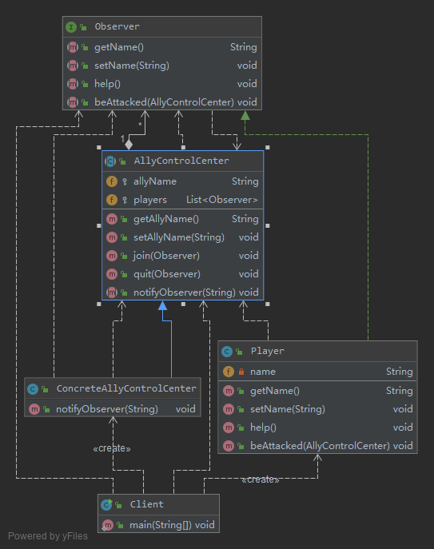
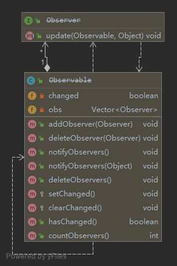

# 对象间的联动——观察者模式  Observer Pattern

观察者模式是使用频率最高的设计模式之一，它用于建立一种对象与对象之间的依赖关系，
一个对象发生改变时将自动通知其他对象，其他对象将相应作出反应。在观察者模式中，
发生改变的对象称为观察目标，而被通知的对象称为观察者，一个观察目标可以对应多个观察者，
而且这些观察者之间可以没有任何相互联系，可以根据需要增加和删除观察者，使得系统更易于扩展。

定义

> 观察者模式(Observer Pattern)：定义对象之间的一种一对多依赖关系，
使得每当一个对象状态发生改变时，其相关依赖对象皆得到通知并被自动更新。
观察者模式的别名包括发布-订阅（Publish/Subscribe）模式、模型-视图（Model/View）模式、
源-监听器（Source/Listener）模式或从属者（Dependents）模式。
观察者模式是一种对象行为型模式。

## [v0 基本实现](v0)

- Subject（目标）：目标又称为主题，它是指被观察的对象。
    > 在目标中定义了一个观察者集合，一个观察目标可以接受任意数量的观察者来观察，
    它提供一系列方法来增加和删除观察者对象，同时它定义了通知方法notify()。目标类可以是接口，也可以是抽象类或具体类。
- ConcreteSubject（具体目标）：具体目标是目标类的子类，
    > 通常它包含有经常发生改变的数据，当它的状态发生改变时，向它的各个观察者发出通知；
    同时它还实现了在目标类中定义的抽象业务逻辑方法（如果有的话）。如果无须扩展目标类，则具体目标类可以省略。
- Observer（观察者）：观察者将对观察目标的改变做出反应，
    > 观察者一般定义为接口，该接口声明了更新数据的方法update()，因此又称为抽象观察者。
- ConcreteObserver（具体观察者）：在具体观察者中维护一个指向具体目标对象的引用，
    > 它存储具体观察者的有关状态，这些状态需要和具体目标的状态保持一致；
    它实现了在抽象观察者Observer中定义的update()方法。通常在实现时，
    可以调用具体目标类的attach()方法将自己添加到目标类的集合中或通过detach()方法将自己从目标类的集合中删除。

如果在具体层具有关联关系，系统的扩展性将受到一定的影响，增加新的具体目标类有时候需要修改原有观察者的代码，
在一定程度上违反了“开闭原则”，但是如果原有观察者类无须关联新增的具体目标，则系统扩展性不受影响。

## [v1 进行多人联机对战游戏的设计](v1)

在该游戏中，多个玩家可以加入同一战队组成联盟，当战队中某一成员受到敌人攻击时将给所有其他盟友发送通知，盟友收到通知后将作出响应。

联动过程可以简单描述如下：
> 联盟成员受到攻击-->发送通知给盟友-->盟友作出响应。

引入一个新的角色*战队控制中心*——来负责维护和管理每个战队所有成员的信息。
当一个联盟成员受到攻击时，将向相应的战队控制中心发送求助信息，战队控制中心再逐一通知每个盟友，盟友再作出响应

- AllyControlCenter充当目标类
- ConcreteAllyControlCenter充当具体目标类
- Observer充当抽象观察者
- Player充当具体观察者

调用链

`Player.beAttacked() --> AllyControlCenter.notifyObserver() -->Player.help()`

## v2 JDK对观察者模式的支持

JDK提供的Observable类及Observer接口结构图

我们可以直接使用Observer接口和Observable类来作为观察者模式的抽象层，
再自定义具体观察者类和具体观察目标类，通过使用JDK中的Observer接口和Observable类，
可以更加方便地在Java语言中应用观察者模式。

**需要注意的是, java从1.9以后已经把这个标记为Deprecated `@Deprecated(since="9")`**

### [Observer is deprecated in Java 9. What should we use instead of it?](https://stackoverflow.com/questions/46380073/observer-is-deprecated-in-java-9-what-should-we-use-instead-of-it)

可以使用`java.beans.PropertyChangeListener`和`java.beans.PropertyChangeEvent`来代替

## v3 观察者模式与MVC

在当前流行的MVC(Model-View-Controller)架构中也应用了观察者模式，
MVC是一种架构模式，它包含三个角色：模型(Model)，视图(View)和控制器(Controller)。
其中模型可对应于观察者模式中的观察目标，而视图对应于观察者，控制器可充当两者之间的中介者。
当模型层的数据发生改变时，视图层将自动改变其显示内容。

## 总结

1.主要优点
    1. 观察者模式可以实现表示层和数据逻辑层的分离，定义了稳定的消息更新传递机制，并抽象了更新接口，
    使得可以有各种各样不同的表示层充当具体观察者角色。
    2. 观察者模式在观察目标和观察者之间建立一个抽象的耦合。观察目标只需要维持一个抽象观察者的集合，无须了解其具体观察者。
    由于观察目标和观察者没有紧密地耦合在一起，因此它们可以属于不同的抽象化层次。
    3. 观察者模式支持广播通信，观察目标会向所有已注册的观察者对象发送通知，简化了一对多系统设计的难度。
    4. 观察者模式满足“开闭原则”的要求，增加新的具体观察者无须修改原有系统代码，在具体观察者与观察目标之间不存在关联关系的情况下，
    增加新的观察目标也很方便。
2.主要缺点
    1. 如果一个观察目标对象有很多直接和间接观察者，将所有的观察者都通知到会花费很多时间。
    2. 如果在观察者和观察目标之间存在循环依赖，观察目标会触发它们之间进行循环调用，可能导致系统崩溃。
    3. 观察者模式没有相应的机制让观察者知道所观察的目标对象是怎么发生变化的，而仅仅只是知道观察目标发生了变化。
    
## 使用

- `java.util.Observer/java.util.Observable`
- `java.util.EventListener`(所有子类)
- `javax.servlet.http.HttpSessionBindingListener`
- `javax.servlet.http.HttpSessionAttributeListener`
- `javax.faces.event.PhaseListener`