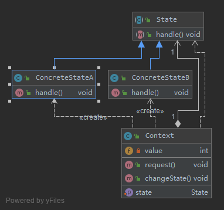
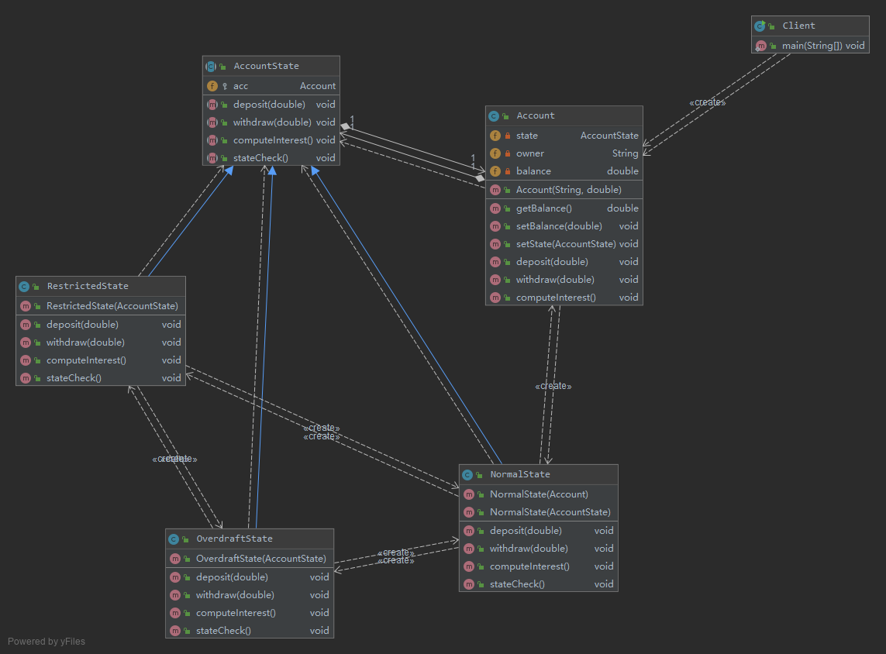
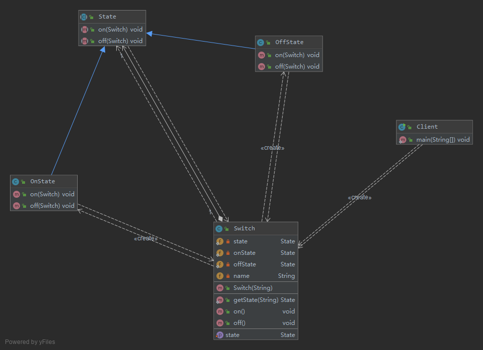
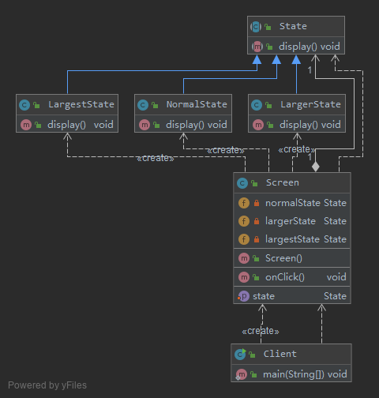

# 处理对象的多种状态及其相互转换——状态模式 State Pattern


状态模式用于解决系统中复杂对象的状态转换以及不同状态下行为的封装问题。
当系统中某个对象存在多个状态，这些状态之间可以进行转换，而且对象在不同状态下行为不相同时可以使用状态模式。
状态模式将一个对象的状态从该对象中分离出来，封装到专门的状态类中，使得对象状态可以灵活变化，
对于客户端而言，无须关心对象状态的转换以及对象所处的当前状态，无论对于何种状态的对象，客户端都可以一致处理。

定义: 
> 状态模式(State Pattern)：允许一个对象在其内部状态改变时改变它的行为，对象看起来似乎修
改了它的类。其别名为状态对象(Objects for States)，状态模式是一种对象行为型模式。

## V0 银行系统账户设计 简单实现

账户存在三种状态，且在不同状态下账户存在不同的行为，具体说明如下：
1. 如果账户中余额大于等于0，则账户的状态为正常状态(Normal State)，此时用户既可以向该账户存款也可以从该账户取款；
2. 如果账户中余额小于0，并且大于-2000，则账户的状态为透支状态(Overdraft State)，
此时用户既可以向该账户存款也可以从该账户取款，但需要按天计算利息；
3. 如果账户中余额等于-2000，那么账户的状态为受限状态(Restricted State)，此时用户只能向该账户存款，不能再从中取款，同时也将按天计算利息；
4. 根据余额的不同，以上三种状态可发生相互转换。

```java
class Account {
    private String state; //状态
    private int balance; //余额
    ......
    //存款操作
    public void deposit() {
        //存款
        stateCheck();
    }
    //取款操作
    public void withdraw() {
        if (state.equalsIgnoreCase("NormalState") || state.equalsIgnoreCase("OverdraftState ")) {
            //取款
            stateCheck();
        } else {
            //取款受限
        }
    }
    //计算利息操作
    public void computeInterest() {
        if(state.equalsIgnoreCase("OverdraftState") || state.equalsIgnoreCase("RestrictedState ")) {
            //计算利息
        }
    }
    //状态检查和转换操作
    public void stateCheck() {
        if (balance >= 0) {
            state = "NormalState";
        } else if (balance > -2000 && balance < 0) {
            state = "OverdraftState";
        } else if (balance == -2000) {
            state = "RestrictedState";
        } else if (balance < -2000) {
            //操作受限
        }
    }
    ......
}
```

1. 几乎每个方法中都包含状态判断语句，以判断在该状态下是否具有该方法以及在特定状态下该方法如何实现，导致代码非常冗长，可维护性较差；
2. 拥有一个较为复杂的stateCheck()方法，包含大量的if…else if…else…语句用于进行状态转换，代码测试难度较大，且不易于维护；
3. 系统扩展性较差，如果需要增加一种新的状态，如冻结状态（Frozen State，在该状态下既不允许存款也不允许取款），
需要对原有代码进行大量修改，扩展起来非常麻烦。

## [v1 了解状态模式](v1)



- Context（环境类）：
    > 环境类又称为上下文类，它是拥有多种状态的对象。由于环境类的状态存在多样性且在不同状态下对象的行为有所不同，
    因此将状态独立出去形成单独的状态类。在环境类中维护一个抽象状态类State的实例，这个实例定义当前状态，在具体实现时，它是一个State子类的对象。
- State（抽象状态类）：
    > 它用于定义一个接口以封装与环境类的一个特定状态相关的行为，在抽象状态类中声明了各种不同状态对应的方法，
    而在其子类中实现类这些方法，由于不同状态下对象的行为可能不同，因此在不同子类中方法的实现可能存在不同，
    相同的方法可以写在抽象状态类中。
- ConcreteState（具体状态类）：
    > 它是抽象状态类的子类，每一个子类实现一个与环境类的一个状态相关的行为，每一个具体状态类对应环境的一个具体状态，
    不同的具体状态类其行为有所不同。

## [v2 完整解决方案](v2)



- Account充当环境类角色
- AccountState充当抽象状态角色
- NormalState、OverdraftState和RestrictedState充当具体状态角色。

## [v3 共享状态](v3)

在有些情况下，多个环境对象可能需要共享同一个状态，如果希望在系统中实现多个环境对象共享一个或多个状态对象，
那么需要将这些状态对象定义为环境类的静态成员对象。

实现共享状态：
如果某系统要求两个开关对象要么都处于开的状态，要么都处于关的状态，在使用时它们的状态必须保持一致，
开关可以由开转换到关，也可以由关转换到开。



从输出结果可以得知两个开关共享相同的状态，如果第一个开关关闭，则第二个开关也将关闭，再次关闭时将输出“已经关闭”；打开时也将得到类似结果。

# [v4 使用环境类实现状态转换 放大镜功能](v4)

在状态模式中实现状态转换时，具体状态类可通过调用环境类Context的setState()方法进行状态的转换操作，
也可以统一由环境类Context来实现状态的转换。此时，增加新的具体状态类可能需要修改其他具体状态类或者环境类的源代码，
否则系统无法转换到新增状态。但是对于客户端来说，无须关心状态类，可以为环境类设置默认的状态类，
而将状态的转换工作交给具体状态类或环境类来完成，具体的转换细节对于客户端而言是透明的。

**放大镜:用户单击“放大镜”按钮之后屏幕将放大一倍，再点击一次“放大镜”按钮屏幕再放大一倍，第三次点击该按钮后屏幕将还原到默认大小。**



- 定义三个屏幕状态类NormalState、LargerState和LargestState来对应屏幕的三种状态，
    - 分别是正常状态、二倍放大状态和四倍放大状态，
- 屏幕类Screen充当环境类

所有的状态转换操作都由环境类Screen来实现，此时，环境类充当了状态管理器角色。
如果需要增加新的状态，例如“八倍状态类”，需要修改环境类，这在一定程度上违背了“开闭原则”，但对其他状态类没有任何影响。

## 总结

1. 主要优点
    1. 封装了状态的转换规则，在状态模式中可以将状态的转换代码封装在环境类或者具体状态类中，
    可以对状态转换代码进行集中管理，而不是分散在一个个业务方法中。
    2. 将所有与某个状态有关的行为放到一个类中，只需要注入一个不同的状态对象即可使环境对象拥有不同的行为。
    3. 允许状态转换逻辑与状态对象合成一体，而不是提供一个巨大的条件语句块，
    状态模式可以让我们避免使用庞大的条件语句来将业务方法和状态转换代码交织在一起。
    4. 可以让多个环境对象共享一个状态对象，从而减少系统中对象的个数。
2. 主要缺点
    1. 状态模式的使用必然会增加系统中类和对象的个数，导致系统运行开销增大。
    2. 状态模式的结构与实现都较为复杂，如果使用不当将导致程序结构和代码的混乱，增加系统设计的难度。
    3. 状态模式对“开闭原则”的支持并不太好，增加新的状态类需要修改那些负责状态转换的源代码，
    否则无法转换到新增状态；而且修改某个状态类的行为也需修改对应类的源代码。

## 使用

- `java.util.Iterator`
- `javax.faces.lifecycle.LifeCycle#execute()`