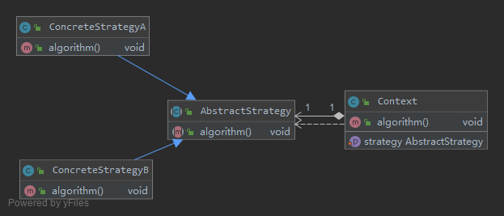
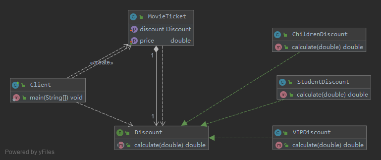

# 算法的封装与切换——策略模式 Strategy Pattern

在策略模式中，我们可以定义一些独立的类来封装不同的算法，每一个类封装一种具体的算法，
在这里，每一个封装算法的类我们都可以称之为一种策略(Strategy)，
为了保证这些策略在使用时具有一致性，一般会提供一个抽象的策略类来做规则的定义，
而每种算法则对应于一个具体策略类。

策略模式的主要目的是将算法的定义与使用分开，也就是将算法的行为和环境分开，
将算法的定义放在专门的策略类中，每一个策略类封装了一种实现算法，
使用算法的环境类针对抽象策略类进行编程，符合“依赖倒转原则”。
在出现新的算法时，只需要增加一个新的实现了抽象策略类的具体策略类即可。

定义： 
> 策略模式(Strategy Pattern)：定义一系列算法类，将每一个算法封装起来，并让它们可以相互替换，
策略模式让算法独立于使用它的客户而变化，也称为政策模式(Policy)。策略模式是一种对象行为型模式。

实现某一个功能有多条途径，每一条途径对应一种算法，此时我们可以使用一种设计模式来实现灵活地选择解决途径，
也能够方便地增加新的解决途径。

## v0 电影票打折方案

1. 学生凭学生证可享受票价8折优惠
2. 年龄在10周岁及以下的儿童可享受每张票减免10元的优惠（原始票价需大于等于20元）
3. 影院VIP用户除享受票价半价优惠外还可进行积分，积分累计到一定额度可换取电影院赠送的奖品
4. 该系统在将来可能还要根据需要引入新的打折方式

```java
class MovieTicket {
    private double price; //电影票价格
    private String type; //电影票类型

    public void setType(String type) {
        this.type = type;
    }

    public double getPrice() {
        return this.calculate();
    }

    public void setPrice(double price) {
        this.price = price;
    }

    //计算打折之后的票价
    public double calculate() {
        //学生票折后票价计算
        if (this.type.equalsIgnoreCase("student")) {
            System.out.println("学生票：");
            return this.price * 0.8;
        }
        //儿童票折后票价计算
        else if (this.type.equalsIgnoreCase("children") && this.price >= 20) {
            System.out.println("儿童票：");
            return this.price - 10;
        }
        //VIP票折后票价计算
        else if (this.type.equalsIgnoreCase("vip")) {
            System.out.println("VIP票：");
            System.out.println("增加积分！");
            return this.price * 0.5;
        } else {
            return this.price; //如果不满足任何打折要求，则返回原始票价
        }
    }
}

客户端测试代码：
class Client {
    public static void main(String args[]) {
        MovieTicket mt = new MovieTicket();
        double originalPrice = 60.0; //原始票价
        double currentPrice; //折后价
        mt.setPrice(originalPrice);
        System.out.println("原始价为：" + originalPrice);
        System.out.println("---------------------------------");
        mt.setType("student"); //学生票
        currentPrice = mt.getPrice();
        System.out.println("折后价为：" + currentPrice);
        System.out.println("---------------------------------");
        mt.setType("children"); //儿童票
        currentPrice = mt.getPrice();
        System.out.println("折后价为：" + currentPrice);
    }
}
```

1. MovieTicket类的calculate()方法非常庞大，它包含各种打折算法的实现代码，
在代码中出现了较长的if…else…语句，不利于测试和维护。
2. 增加新的打折算法或者对原有打折算法进行修改时必须修改MovieTicket类的源代码，违反了“开闭原则”，系统的灵活性和可扩展性较差。
3. 算法的复用性差，如果在另一个系统（如商场销售管理系统）中需要重用某些打折算法，
只能通过对源代码进行复制粘贴来重用，无法单独重用其中的某个或某些算法（重用较为麻烦）

## [v1 策略模式简单实现](v1)



- Context（环境类）：
    > 环境类是使用算法的角色，它在解决某个问题（即实现某个方法）时可以采用多种策略。
    在环境类中维持一个对抽象策略类的引用实例，用于定义所采用的策略。
- Strategy（抽象策略类）：
    > 它为所支持的算法声明了抽象方法，是所有策略类的父类，它可以是抽象类或具体类，也可以是接口。
    环境类通过抽象策略类中声明的方法在运行时调用具体策略类中实现的算法。
- ConcreteStrategy（具体策略类）：
    > 它实现了在抽象策略类中声明的算法，在运行时，具体策略类将覆盖在环境类中定义的抽象策略类对象，使用一种具体的算法实现某个业务处理。
- 客户端
    ```java
    Context context = new Context();
    AbstractStrategy strategy;
    strategy = new ConcreteStrategyA(); //可在运行时指定类型
    context.setStrategy(strategy);
    context.algorithm();
    ```

在客户端代码中只需注入一个具体策略对象，可以将具体策略类类名存储在配置文件中，
通过反射来动态创建具体策略对象，从而使得用户可以灵活地更换具体策略类，
增加新的具体策略类也很方便。策略模式提供了一种可插入式(Pluggable)算法的实现方案。

## [v2 电影票打折完整方案](v2)



- MovieTicket充当环境类角色
- Discount充当抽象策略角色
- StudentDiscount、ChildrenDiscount 和VIPDiscount充当具体策略角色

为了提高系统的灵活性和可扩展性，我们将具体策略类的类名存储在配置文件中，并通过工具类XMLUtil来读取配置文件并反射生成对象

如果需要增加新的打折方式，原有代码均无须修改，只要增加一个新的折扣类作为抽象折扣类的子类，
实现在抽象折扣类中声明的打折方法，然后修改配置文件，将原有具体折扣类类名改为新增折扣类类名即可，完全符合“开闭原则”。

## 总结

1. 主要优点
    1. 策略模式提供了对“开闭原则”的完美支持
    2. 策略模式提供了管理相关的算法族的办法。策略类的等级结构定义了一个算法或行为族，恰当使用继承可以把公共的代码移到抽象策略类中，从而避免重复的代码。
    3. 策略模式提供了一种可以替换继承关系的办法。
    4. 使用策略模式可以避免多重条件选择语句。
    5. 策略模式提供了一种算法的复用机制，由于将算法单独提取出来封装在策略类中，因此不同的环境类可以方便地复用这些策略类。
1. 主要缺点
    1. 客户端必须知道所有的策略类，并自行决定使用哪一个策略类。这就意味着客户端必须理解这些算法的区别，以便适时选择恰当的算法。
    2. 策略模式将造成系统产生很多具体策略类，任何细小的变化都将导致系统要增加一个新的具体策略类。
    3. 无法同时在客户端使用多个策略类，也就是说，在使用策略模式时，客户端每次只能使用一个策略类，
    不支持使用一个策略类完成部分功能后再使用另一个策略类来完成剩余功能的情况。

## 使用

- `java.util.Comparator#compare()`
- `javax.servlet.http.HttpServlet`
- `javax.servlet.Filter#doFilter()`