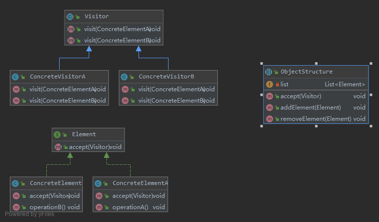
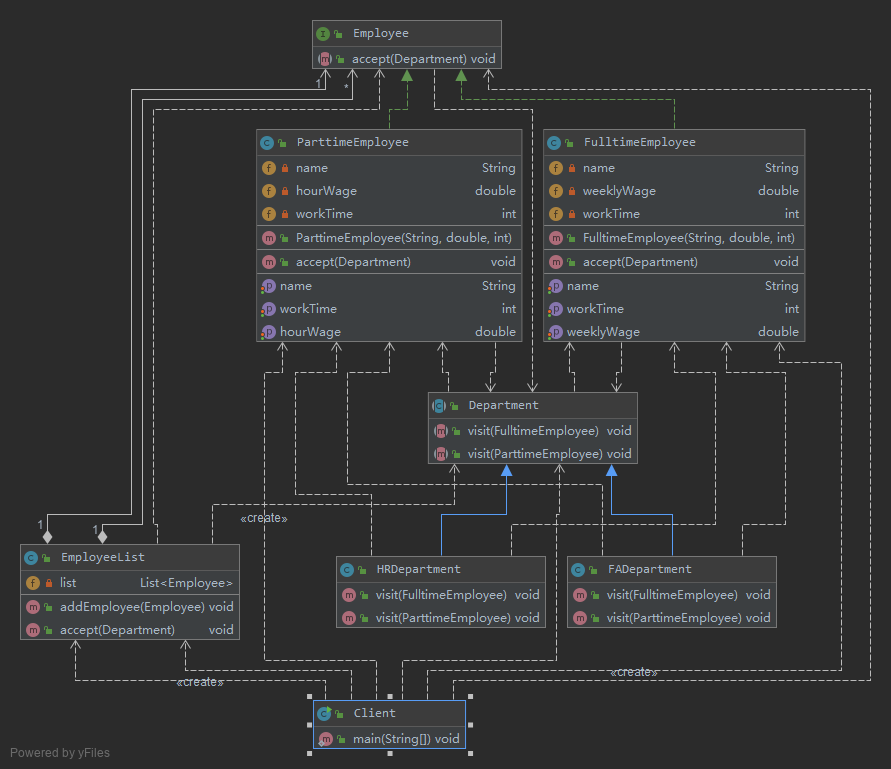
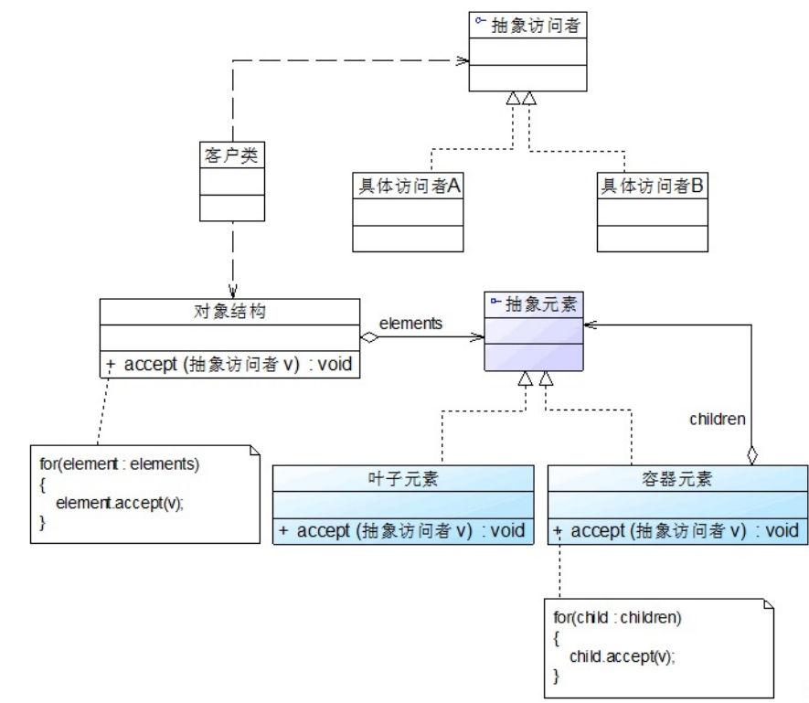

# 操作复杂对象结构——访问者模式 Visitor Pattern

访问者模式是一种较为复杂的行为型设计模式，它包含访问者和被访问元素两个主要组成部分，这些被访问的元素通常具有不同的类型，
且不同的访问者可以对它们进行不同的访问操作。访问者模式使得用户可以在不修改现有系统的情况下扩展系统的功能，
为这些不同类型的元素增加新的操作。

在使用访问者模式时，被访问元素通常不是单独存在的，它们存储在一个集合中，这个集合被称为“对象结构”，
访问者通过遍历对象结构实现对其中存储的元素的逐个操作。

定义
> 访问者模式(Visitor Pattern):提供一个作用于某对象结构中的各元素的操作表示，
它使我们可以在不改变各元素的类的前提下定义作用于这些元素的新操作。访问者模式是一种对象行为型模式。

## [v0 简单实现](v0)

- Vistor（抽象访问者）：
    - 抽象访问者为对象结构中每一个具体元素类ConcreteElement声明一个访问操作，
    从这个操作的名称或参数类型可以清楚知道需要访问的具体元素的类型，
    具体访问者需要实现这些操作方法，定义对这些元素的访问操作。
    - 抽象访问者定义了访问元素对象的方法，通常为每一种类型的元素对象都提供一个访问方法，而具体访问者可以实现这些访问方法
- ConcreteVisitor（具体访问者）：
    - 具体访问者实现了每个由抽象访问者声明的操作，每一个操作用于访问对象结构中一种类型的元素。
    - 使用了重载visit()方法的方式来定义多个方法用于操作不同类型的元素对象。
- Element（抽象元素）：
    - 抽象元素一般是抽象类或者接口，它定义一个accept()方法，该方法通常以一个抽象访问者作为参数。
    - 对于元素类，在其中一般都定义了一个accept()方法，用于接受访问者的访问
- ConcreteElement（具体元素）：
    具体元素实现了accept()方法，在accept()方法中调用访问者的访问方法以便完成对一个元素的操作。
-  ObjectStructure（对象结构）：
    对象结构是一个元素的集合，它用于存放元素对象，并且提供了遍历其内部元素的方法。它可以结合组合模式来实现，
    也可以是一个简单的集合对象，如一个List对象或一个Set对象。

## [v1 OA系统中员工数据汇总](v1)

包括正式员工和临时工，每周人力资源部和财务部等部门需要对员工数据进行汇总，汇总数据包括员工工作时间、员工工资等。

该公司基本制度如下：
1. 正式员工(Full time Employee)每周工作时间为40小时，不同级别、不同部门的员工每周基本工资不同；
    - 如果超过40小时，超出部分按照100元/小时作为加班费；
    - 如果少于40小时，所缺时间按照请假处理，请假所扣工资以80元/小时计算，直到基本工资扣除到零为止。
    - 除了记录实际工作时间外，人力资源部需记录加班时长或请假时长，作为员工平时表现的一项依据。
2. 临时工(Part time Employee)每周工作时间不固定，基本工资按小时计算，不同岗位的临时工小时工资不同。
    - 人力资源部只需记录实际工作时间。

人力资源部和财务部工作人员可以根据各自的需要对员工数据进行汇总处理，人力资源部负责汇总每周员工工作时间，而财务部负责计算每周员工工资。

- 具体访问者角色
    - FADepartment表示财务部
    - HRDepartment表示人力资源部
- 抽象父类Department充当抽象访问者角色
- EmployeeList充当对象结构，用于存储员工列表
- 具体元素角色
    - FulltimeEmployee表示正式员工
    - ParttimeEmployee表示临时工
- 父接口Employee充当抽象元素角色
- 为了提高系统的灵活性和可扩展性，将具体访问者类的类名存储在配置文件中，并通过工具类XMLUtil来读取配置文件并反射生成对象
    如果需要更换具体访问者类，无须修改源代码，只需修改配置文件

如果要在系统中增加一种新的访问者，无须修改源代码，只要增加一个新的具体访问者类即可，
在该具体访问者中封装了新的操作元素对象的方法。从增加新的访问者的角度来看，访问者模式符合“开闭原则”。

如果要在系统中增加一种新的具体元素，由于原有系统并未提供相应的访问接口，因此必须对原有系统进行修改，
在原有的抽象访问者类和具体访问者类中增加相应的访问方法。从增加新的元素的角度来看，访问者模式违背了“开闭原则”。

## v2 访问者模式与组合模式联用

在访问者模式中，包含一个用于存储元素对象集合的对象结构，我们通常可以使用迭代器来遍历对象结构，
同时具体元素之间可以存在整体与部分关系，有些元素作为容器对象，有些元素作为成员对象，可以使用组合模式来组织元素。

## 总结

1.主要优点
    1. 增加新的访问操作很方便。使用访问者模式，增加新的访问操作就意味着增加一个新的具体访问者类，实现简单，无须修改源代码，符合“开闭原则”。
    2. 将有关元素对象的访问行为集中到一个访问者对象中，而不是分散在一个个的元素类中。
    类的职责更加清晰，有利于对象结构中元素对象的复用，相同的对象结构可以供多个不同的访问者访问。
    3. 让用户能够在不修改现有元素类层次结构的情况下，定义作用于该层次结构的操作。
2.主要缺点
    1. 增加新的元素类很困难。在访问者模式中，每增加一个新的元素类都意味着要在抽象访问者角色中增加一个新的抽象操作，
    并在每一个具体访问者类中增加相应的具体操作，这违背了“开闭原则”的要求。
    2. 破坏封装。访问者模式要求访问者对象访问并调用每一个元素对象的操作，
    这意味着元素对象有时候必须暴露一些自己的内部操作和内部状态，否则无法供访问者访问。

## 使用

- `javax.lang.model.element.AnnotationValue和AnnotationValueVisitor`
- `javax.lang.model.element.Element和ElementVisitor`
- `javax.lang.model.type.TypeMirror和TypeVisitor`
