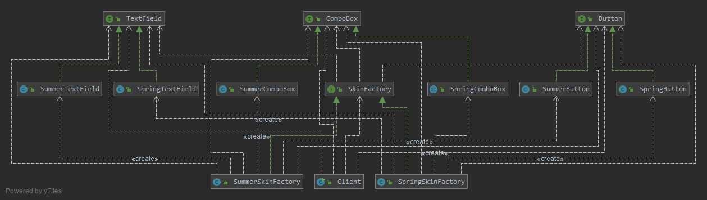

# 抽象工厂模式-Abstract Factory Pattern

抽象工厂模式为创建一组对象提供了一种解决方案。与工厂方法模式相比，抽象工厂模式中
的具体工厂不只是创建一种产品，它负责创建一族产品。

抽象工厂模式定义如下：
抽象工厂模式(Abstract Factory Pattern)：提供一个创建一系列相关或相互依赖对象的接口，而
无须指定它们具体的类。抽象工厂模式又称为Kit模式，它是一种对象创建型模式。

在抽象工厂模式中，每一个具体工厂都提供了多个工厂方法用于产生多种不同类型的产品，
这些产品构成了一个产品族

## [v0](v0) 代码中:

- SkinFactory接口充当抽象工厂，
    - 其子类SpringSkinFactory和SummerSkinFactory充当具体工厂，
- 接口Button、TextField和ComboBox充当抽象产品，
    - 其子类SpringButton、SpringTextField、SpringComboBox和SummerButton、SummerTextField、SummerComboBox充当具体产品。
    
为了让系统具备良好的灵活性和可扩展性，我们引入了工具类XMLUtil和配置文件

如果需要更换皮肤，只需修改配置文件即可，在实际环境中，我们可以提供可视化界面，
例如菜单或者窗口来修改配置文件，用户无须直接修改配置文件。如果需要增加新的皮肤，
只需增加一族新的具体组件并对应提供一个新的具体工厂，修改配置文件即可使用新的皮肤，
原有代码无须修改，符合“开闭原则”。

## 抽象工厂模式总结

抽象工厂模式是工厂方法模式的进一步延伸，由于它提供了功能更为强大的工厂类并且具备较好的可扩展性，
在软件开发中得以广泛应用，尤其是在一些框架和API类库的设计中，
例如在Java语言的AWT（抽象窗口工具包）中就使用了抽象工厂模式，
它使用抽象工厂模式来实现在不同的操作系统中应用程序呈现与所在操作系统一致的外观界面。
抽象工厂模式也是在软件开发中最常用的设计模式之一。

1. 主要优点
    1. 抽象工厂模式隔离了具体类的生成，使得客户并不需要知道什么被创建。由于这种隔离，
    更换一个具体工厂就变得相对容易，所有的具体工厂都实现了抽象工厂中定义的那些公共接口，
    因此只需改变具体工厂的实例，就可以在某种程度上改变整个软件系统的行为。
    2. 当一个产品族中的多个对象被设计成一起工作时，它能够保证客户端始终只使用同一个产品族中的对象。
    3. 增加新的产品族很方便，无须修改已有系统，符合“开闭原则”。
2. 增加新的产品等级结构麻烦，需要对原有系统进行较大的修改，甚至需要修改抽象层代码，这显然会带来较大的不便，违背了“开闭原则”。

## 使用

- `java.util.Calendar#getInstance()`
- `java.util.Arrays#asList()`
- `java.util.ResourceBundle#getBundle()`
- `java.net.URL#openConnection()`
- `java.sql.DriverManager#getConnection()`
- `java.sql.Connection#createStatement()`
- `java.sql.Statement#executeQuery()`
- `java.text.NumberFormat#getInstance()`
- `java.lang.management.ManagementFactory (所有getXXX()方法)`
- `java.nio.charset.Charset#forName()`
- `javax.xml.parsers.DocumentBuilderFactory#newInstance()`
- `javax.xml.transform.TransformerFactory#newInstance()`
- `javax.xml.xpath.XPathFactory#newInstance()`