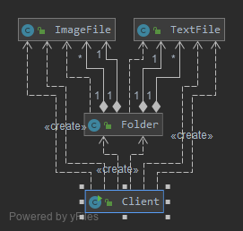
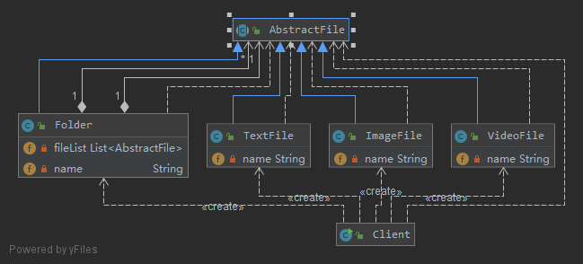

# 树形结构的处理——组合模式 (Composite Pattern)

树形结构在软件中随处可见，例如操作系统中的目录结构、应用软件中的菜单、办公系统中的公司组织结构等等，
如何运用面向对象的方式来处理这种树形结构是组合模式需要解决的问题，
组合模式通过一种巧妙的设计方案使得用户可以一致性地处理整个树形结构或者树形结构的一部分，
也可以一致性地处理树形结构中的叶子节点（不包含子节点的节点）和容器节点（包含子节点的节点）。

组合模式(Composite Pattern)：组合多个对象形成树形结构以表示具有“整体—部分”关系的层次结构。
组合模式对单个对象（即叶子对象）和组合对象（即容器对象）的使用具有一致性，
组合模式又可以称为“整体—部分”(Part-Whole)模式，它是一种对象结构型模式。

## [v0](v0) 简单实现

杀毒(AntiVirus)软件，该软件既可以对某个文件夹(Folder)杀毒，
也可以对某个指定的文件(File)进行杀毒。该杀毒软件还可以根据各类文件的特点，为不同类型的文件提供不同的杀毒方式，
例如图像文件(ImageFile)和文本文件(TextFile)的杀毒方式就有所差异。



1. 文件夹类Folder的设计和实现都非常复杂
2. 由于系统没有提供抽象层，客户端代码必须有区别地对待充当容器的文件夹Folder和充当叶子的ImageFile和TextFile，无法统一对它们进行处理
3. 系统的灵活性和可扩展性差

## v1 组合模式

在组合模式中引入了抽象构件类Component，它是所有容器类和叶子类的公共父类，客户端针对Component进行编程。
```java
abstract class Component {
    public abstract void add(Component c); //增加成员
    public abstract void remove(Component c); //删除成员
    public abstract Component getChild(int i); //获取成员
    public abstract void operation(); //业务方法
}

class Leaf extends Component {
    public void add(Component c) {
    //异常处理或错误提示
    }
    public void remove(Component c) {
    //异常处理或错误提示
    }
    public Component getChild(int i) {
    //异常处理或错误提示
    return null;
    }
    public void operation() {
    //叶子构件具体业务方法的实现
    }
}

class Composite extends Component {
    private ArrayList<Component> list = new ArrayList<Component>();
    public void add(Component c) {
        list.add(c);
    }
    public void remove(Component c) {
        list.remove(c);
    }
    public Component getChild(int i) {
        return (Component)list.get(i);
    }
    public void operation() {
        //容器构件具体业务方法的实现
        //递归调用成员构件的业务方法
        for(Object obj:list) {
            ((Component)obj).operation();
        }
    }
}
```

- Component（抽象构件）：它可以是接口或抽象类，为叶子构件和容器构件对象声明接口，
在该角色中可以包含所有子类共有行为的声明和实现。
在抽象构件中定义了访问及管理它的子构件的方法，如增加子构件、删除子构件、获取子构件等。
- Leaf（叶子构件）：它在组合结构中表示叶子节点对象，叶子节点没有子节点，
它实现了在抽象构件中定义的行为。对于那些访问及管理子构件的方法，可以通过异常等方式进行处理。
- Composite（容器构件）：它在组合结构中表示容器节点对象，容器节点包含子节点，其子节点可以是叶子节点，也可以是容器节点，
它提供一个集合用于存储子节点，实现了在抽象构件中定义的行为，包括那些访问及管理子构件的方法，
在其业务方法中可以递归调用其子节点的业务方法。

## [v2](v2) 完整解决方案



- AbstractFile充当抽象构件类
- Folder充当容器构件类
- ImageFile、TextFile和VideoFile充当叶子构件类

## [v3](v3) 透明组合模式与安全组合模式

1. 将叶子构件的add()、remove()等方法的实现代码移至AbstractFile类中，由AbstractFile提供统一的默认实现
    ```java
    //提供默认实现的抽象构件类
    abstract class AbstractFile {
        public void add(AbstractFile file) {
            System.out.println("对不起，不支持该方法！");
        }
        public void remove(AbstractFile file) {
            System.out.println("对不起，不支持该方法！");
        }
        public AbstractFile getChild(int i) {
            System.out.println("对不起，不支持该方法！");
            return null;
        }
        public abstract void killVirus();
    }
    ```
2. 在抽象构件AbstractFile中不声明任何用于访问和管理成员构件的方法
    ```java
    abstract class AbstractFile {
        public abstract void killVirus();
    }
    ```

- 透明组合模式
    - 优点: 抽象构件Component中声明了所有用于管理成员对象的方法，包括add()、remove()以及getChild()等方法，
    这样做的好处是确保所有的构件类都有相同的接口。
    - 缺点是不够安全，因为叶子对象和容器对象在本质上是有区别的。叶子对象不可能有下一个层次的对象，
    不可能包含成员对象，因此为其提供add()、remove()以及getChild()等方法是没有意义的
- 安全组合模式
    - 优点: 在抽象构件Component中没有声明任何用于管理成员对象的方法，
    而是在Composite类中声明并实现这些方法。这种做法是安全的，
    因为根本不向叶子对象提供这些管理成员对象的方法，对于叶子对象，客户端不可能调用到这些方法
    - 缺点: 缺点是不够透明，因为叶子构件和容器构件具有不同的方法，
    且容器构件中那些用于管理成员对象的方法没有在抽象构件类中定义，
    因此客户端不能完全针对抽象编程，必须有区别地对待叶子构件和容器构件。
    
## 总结

组合模式使用面向对象的思想来实现树形结构的构建与处理，描述了如何将容器对象和叶子对象进行递归组合，实现简单，灵活性好。

1. 主要优点：
    1. 组合模式可以清楚地定义分层次的复杂对象，表示对象的全部或部分层次，它让客户端忽略了层次的差异，
    方便对整个层次结构进行控制。
    2. 客户端可以一致地使用一个组合结构或其中单个对象，不必关心处理的是单个对象还是整个组合结构，简化了客户端代码。
    3. 在组合模式中增加新的容器构件和叶子构件都很方便，无须对现有类库进行任何修改，符合“开闭原则”。
    4. 组合模式为树形结构的面向对象实现提供了一种灵活的解决方案，通过叶子对象和容器对象的递归组合，
    可以形成复杂的树形结构，但对树形结构的控制却非常简单。
1. 主要缺点
    在增加新构件时很难对容器中的构件类型进行限制。有时候我们希望一个容器中只能有某些特定类型的对象，
    例如在某个文件夹中只能包含文本文件，使用组合模式时，不能依赖类型系统来施加这些约束，
    因为它们都来自于相同的抽象层，在这种情况下，必须通过在运行时进行类型检查来实现，这个实现过程较为复杂。

## 使用

Java SE中的AWT和Swing包的设计就基于组合模式，在这些界面包中为用户提供了大量的容器构件（如Container）和成员构件（如Checkbox、Button和TextComponent等）