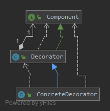
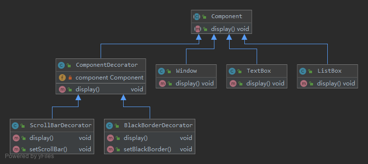

# 扩展系统功能 -- 装饰模式(Decorator Pattern)

对已有对象的功能进行扩展，以获得更加符合用户需求的对象，
使得对象具有更加强大的功能。这种技术对应于一种被称之为装饰模式的设计模式

装饰模式是一种用于替代继承的技术，它通过一种无须定义子类的方式来给对象动态增加职责，
使用对象之间的关联关系取代类之间的继承关系。
在装饰模式中引入了装饰类，在装饰类中既可以调用待装饰的原有类的方法，还可以增加新的方法，以扩充原有类的功能。

定义: 动态地给一个对象增加一些额外的职责，就增加对象功能来说，装饰模式比生成子类实现更为灵活。装饰模式是一种对象结构型模式。

## [v0](v0)




- Component（抽象构件）：它是具体构件和抽象装饰类的共同父类，声明了在具体构件中实现的业务方法，
它的引入可以使客户端以一致的方式处理未被装饰的对象以及装饰之后的对象，实现客户端的透明操作。
- ConcreteComponent（具体构件）：它是抽象构件类的子类，用于定义具体的构件对象，
实现了在抽象构件中声明的方法，装饰器可以给它增加额外的职责（方法）。
- Decorator（抽象装饰类）：它也是抽象构件类的子类，用于给具体构件增加职责，
但是具体职责在其子类中实现。它维护一个指向抽象构件对象的引用，通过该引用可以调用装饰之前构件对象的方法，
并通过其子类扩展该方法，以达到装饰的目的。
- ConcreteDecorator（具体装饰类）：它是抽象装饰类的子类，负责向构件添加新的职责。
每一个具体装饰类都定义了一些新的行为，它可以调用在抽象装饰类中定义的方法，并可以增加新的方法用以扩充对象的行为。

## [v1 完整解决方案 图形界面构件库的设计](v1)

该构件库提供了大量基本构件，如窗体、文本框、列表框等，由于在使用该构件库时，
用户经常要求定制一些特效显示效果，如带滚动条的窗体、带黑色边框的文本框、既带滚动条又带黑色边框的列表框等等，
因此经常需要对该构件库进行扩展以增强其功能



- Component充当抽象构件类，其子类Window、TextBox、ListBox充当具体构件类，
- Component类的另一个子类ComponentDecorator充当抽象装饰类，
- ComponentDecorator的子类ScrollBarDecorator和BlackBorderDecorator充当具体装饰类。

[客户端代码](v1/Client.java)
```java
component = new Window();
componentSB = new ScrollBarDecorator(component);
componentBB = new BlackBorderDecorator(componentSB); //将装饰了一次之后的对象继续注入到另一个装饰类中，进行第二次装饰
componentBB.display();
```

如果需要在原有系统中增加一个新的具体构件类或者新的具体装饰类，无须修改现有类库代码，
只需将它们分别作为抽象构件类或者抽象装饰类的子类即可。
使用装饰模式之后将大大减少了子类的个数，让系统扩展起来更加方便，而且更容易维护，是取代继承复用的有效方式之一。

## 透明装饰模式

在透明装饰模式中，要求客户端完全针对抽象编程，
装饰模式的透明性要求客户端程序不应该将对象声明为具体构件类型或具体装饰类型，而应该全部声明为抽象构件类型。
对于客户端而言，具体构件对象和具体装饰对象没有任何区别。

**v1**中的[客户端代码](v1/Client.java)使用的就是透明装饰模式

透明装饰模式可以让客户端透明地使用装饰之前的对象和装饰之后的对象，
无须关心它们的区别，此外，还可以对一个已装饰过的对象进行多次装饰，
得到更为复杂、功能更为强大的对象。

## 半透明装饰模式

透明装饰模式的设计难度较大，而且有时我们需要单独调用新增的业务方法。
为了能够调用到新增方法，我们不得不用具体装饰类型来定义装饰之后的对象，
而具体构件类型还是可以使用抽象构件类型来定义，这种装饰模式即为半透明装饰模式，
也就是说，对于客户端而言，具体构件类型无须关心，是透明的；但是具体装饰类型必须指定，这是不透明的。

## 总结

1. 主要优点
    1. 对于扩展一个对象的功能，装饰模式比继承更加灵活性，不会导致类的个数急剧增加。
    2. 可以通过一种动态的方式来扩展一个对象的功能，通过配置文件可以在运行时选择不同的具体装饰类，从而实现不同的行为。
    3. 可以对一个对象进行多次装饰，通过使用不同的具体装饰类以及这些装饰类的排列组合，可以创造出很多不同行为的组合，得到功能更为强大的对象。
    4. 具体构件类与具体装饰类可以独立变化，用户可以根据需要增加新的具体构件类和具体装饰类，原有类库代码无须改变，符合“开闭原则”。
2. 主要缺点
    1. 使用装饰模式进行系统设计时将产生很多小对象，这些对象的区别在于它们之间相互连接的方式有所不同，
    而不是它们的类或者属性值有所不同，大量小对象的产生势必会占用更多的系统资源，在一定程序上影响程序的性能。
    2. 装饰模式提供了一种比继承更加灵活机动的解决方案，但同时也意味着比继承更加易于出错，
    排错也很困难，对于多次装饰的对象，调试时寻找错误可能需要逐级排查，较为繁琐。

## 使用

- 在JavaIO中的输入流和输出流的设计
- javax.swing包中一些图形界面构件功能的增强
- `java.io.BufferedInputStream(InputStream)`
- `java.io.DataInputStream(InputStream)`
- `java.io.BufferedOutputStream(OutputStream)`
- `java.util.zip.ZipOutputStream(OutputStream)`
- `java.util.Collections#checked[List|Map|Set|SortedSet|SortedMap]()`