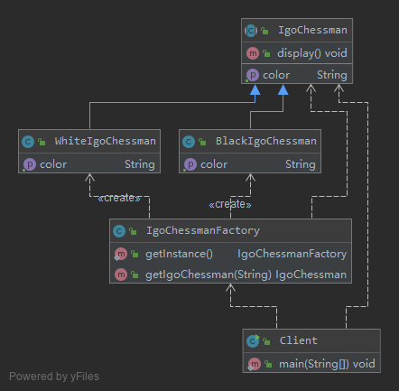
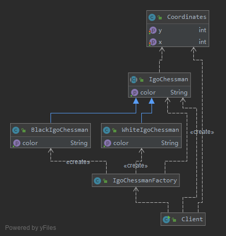

# 实现对象的复用 — 享元模式(Flyweight Pattern)

当一个软件系统在运行时产生的对象数量太多，将导致运行代价过高，带来系统性能下降等问题。
享元模式通过共享技术实现相同或相似对象的重用，在逻辑上每一个出现的字符都有一个对象与之对应，
然而在物理上它们却共享同一个享元对象，这个对象可以出现在一个字符串的不同地方，
相同的字符对象都指向同一个实例，在享元模式中，存储这些共享实例对象的地方称为享元池(Flyweight Pool)。

享元模式(Flyweight Pattern)：
> 运用共享技术有效地支持大量细粒度对象的复用。系统只使用少量的对象，而这些对象都很相似，
状态变化很小，可以实现对象的多次复用。由于享元模式要求能够共享的对象必须是细粒度对象，
因此它又称为轻量级模式，它是一种对象结构型模式。

享元模式以共享的方式高效地支持大量细粒度对象的重用，
享元对象能做到共享的关键是区分了内部状态(Intrinsic State)和外部状态(Extrinsic State)。

1. 内部状态
    >  内部状态是存储在享元对象内部并且不会随环境改变而改变的状态，内部状态可以共享。
      如字符的内容，不会随外部环境的变化而变化，无论在任何环境下字符“a”始终是“a”，都不会变成“b”。
2. 外部状态
    > 外部状态是随环境改变而改变的、不可以共享的状态。享元对象的外部状态通常由客户端保存，
    并在享元对象被创建之后，需要使用的时候再传入到享元对象内部。一个外部状态与另一个外部状态之间是相互独立的。
    
## v0 结构

- Flyweight: 抽象享元类
    在享元类中要将内部状态和外部状态分开处理，通常将内部状态作为享元类的成员变量，而外部状态通过注入的方式添加到享元类中。
- ConcreteFlyweight: 具体享元类
- UnsharedConcreteFlyweight: 非共享具体享元类
- FlyweightFactory: 享元工厂类

## [v1 - 设计围棋软件中的棋子](v1)

- IgoChessman充当抽象享元类
- BlackIgoChessman和WhiteIgoChessman充当具体享元类
- IgoChessmanFactory充当享元工厂类

## [v2 - 引入外部状态 棋子位置](v2)

除了增加一个坐标类Coordinates以外，抽象享元类IgoChessman中的display()方法也将对应增加一个Coordinates类型的参数，
用于在显示棋子时指定其坐标

## 单纯享元模式和复合享元模式

1.单纯享元模式
    在单纯享元模式中，所有的具体享元类都是可以共享的，不存在非共享具体享元类。
2. 复合享元模式
   将一些单纯享元对象使用组合模式加以组合，还可以形成复合享元对象，这样的复合享元对象本身不能共享，
   但是它们可以分解成单纯享元对象，而后者则可以共享。

## 其他

1. 享元模式通常需要和其他模式一起联用
    1. 在享元模式的享元工厂类中通常提供一个静态的工厂方法用于返回享元对象，使用简单工厂模式来生成享元对象。
    2. 在一个系统中，通常只有唯一一个享元工厂，因此可以使用单例模式进行享元工厂类的设计。
    3. 享元模式可以结合组合模式形成复合享元模式，统一对多个享元对象设置外部状态。
2. 享元模式与String类, JDK类库中的String类使用了享元模式，

## 总结

1.主要优点
    1. 可以极大减少内存中对象的数量，使得相同或相似对象在内存中只保存一份，从而可以节约系统资源，提高系统性能。
    2. 享元模式的外部状态相对独立，而且不会影响其内部状态，从而使得享元对象可以在不同的环境中被共享。
2.主要缺点
    1. 享元模式使得系统变得复杂，需要分离出内部状态和外部状态，这使得程序的逻辑复杂化。
    2. 为了使对象可以共享，享元模式需要将享元对象的部分状态外部化，而读取外部状态将使得运行时间变长。

## 使用

- `java.lang.Integer#valueOf(int)`
- `java.lang.Boolean#valueOf(boolean)`
- `java.lang.Byte#valueOf(byte)`
- `java.lang.Character#valueOf(char)`