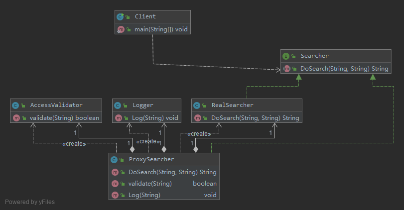

# 代理模式-Proxy Pattern

代理模式是常用的结构型设计模式之一，
当无法直接访问某个对象或访问某个对象存在困难时可以通过一个代理对象来间接访问，
为了保证客户端使用的透明性，所访问的真实对象与代理对象需要实现相同的接口。
根据代理模式的使用目的不同，代理模式又可以分为多种类型，
例如保护代理、远程代理、虚拟代理、缓冲代理等，它们应用于不同的场合，满足用户的不同需求。

代理模式：给某一个对象提供一个代理或占位符，并由代理对象来控制对原对象的访问。

代理模式是一种对象结构型模式。在代理模式中引入了一个新的代理对象，
代理对象在客户端对象和目标对象之间起到中介的作用，
它去掉客户不能看到的内容和服务或者增添客户需要的额外的新服务。

## v0 


代理模式的结构图比较简单，但是在真实的使用和实现过程中要复杂很多，特别是代理类的设计和实现。

抽象主题类声明了真实主题类和代理类的公共方法，它可以是接口、抽象类或具体类，
客户端针对抽象主题类编程，一致性地对待真实主题和代理主题，典型的抽象主题类代码如下:
```java
public abstract class Subject {
    public abstract void Request();
}
```

真实主题类继承了抽象主题类，提供了业务方法的具体实现，其典型代码如下：
```java
class RealSubject extends Subject {
    @Override
    public void Request() {
        //业务方法具体实现代码
    }
}
```

代理类也是抽象主题类的子类，它维持一个对真实主题对象的引用，调用在真实主题中实现的业务方法，
在调用时可以在原有业务方法的基础上附加一些新的方法来对功能进行扩充或约束
```java
class Proxy extends Subject {
private RealSubject realSubject = new RealSubject(); //维持一个对真实主题对象的引用
    public void PreRequest() {
        // ...
    }
    @Override
    public void Request() {
        PreRequest();
        realSubject.Request(); //调用真实主题对象的方法
        PostRequest();
    }
    public void PostRequest() {
        // ...
    }
}
```

代理类的实现比上述代码要复杂很多，代理模式根据其目的和实现方式
不同可分为很多种类，其中常用的几种代理模式简要说明如下：

1. 远程代理(Remote Proxy)：为一个位于不同的地址空间的对象提供一个本地的代理对象，
这个不同的地址空间可以是在同一台主机中，也可是在另一台主机中，远程代理又称为大使(Ambassador)。
2. 虚拟代理(Virtual Proxy)：如果需要创建一个资源消耗较大的对象，
先创建一个消耗相对较小的对象来表示，真实对象只在需要时才会被真正创建。
3. 保护代理(Protect Proxy)：控制对一个对象的访问，可以给不同的用户提供不同级别的使用权限。
4. 缓冲代理(Cache Proxy)：为某一个目标操作的结果提供临时的存储空间，以便多个客户端可以共享这些结果。
5. 智能引用代理(Smart Reference Proxy)：当一个对象被引用时，提供一些额外的操作，
例如将对象被调用的次数记录下来等。

## [v1 收费商务信息查询系统](v1)



- 业务类AccessValidator用于验证用户身份: 身份验证类，业务类，它提供方法Validate()来实现身份验证
- 业务类Logger用于记录用户查询日志: 日志记录类，业务类，它提供方法Log()来保存日志
- Searcher充当抽象主题角色: 抽象查询类，充当抽象主题角色，它声明了DoSearch()方法
- RealSearcher充当真实主题角色: 具体查询类，充当真实主题角色，它实现查询功能，提供方法DoSearch()来查询信息。
- ProxySearcher充当代理主题角色: 代理查询类，充当代理主题角色，它是查询代理，
    维持了对RealSearcher对象、AccessValidator对象和Logger对象的引用。

本实例是保护代理和智能引用代理的应用实例，
在代理类ProxySearcher中实现对真实主题类的权限控制和引用计数，
如果需要在访问真实主题时增加新的访问控制机制和新功能，
只需增加一个新的代理类，再修改配置文件，在客户端代码中使用新增代理类即可，
源代码无须修改，符合开闭原则。

## 远程代理 Remote Proxy

> 远程代理(Remote Proxy)是一种常用的代理模式，它使得客户端程序可以访问在远程主机上的对象，
远程主机可能具有更好的计算性能与处理速度，可以快速响应并处理客户端的请求。
远程代理可以将网络的细节隐藏起来，使得客户端不必考虑网络的存在。
客户端完全可以认为被代理的远程业务对象是在本地而不是在远程，
而远程代理对象承担了大部分的网络通信工作，并负责对远程业务方法的调用。

## 虚拟代理 Virtual Proxy

> 虚拟代理(Virtual Proxy)也是一种常用的代理模式，对于一些占用系统资源较多或者加载时间较长的对象，
可以给这些对象提供一个虚拟代理。在真实对象创建成功之前虚拟代理扮演真实对象的替身，
而当真实对象创建之后，虚拟代理将用户的请求转发给真实对象。

## 缓冲代理 Cache Proxy

> 缓冲代理(Cache Proxy)也是一种较为常用的代理模式，它为某一个操作的结果提供临时的缓存存储空间，
以便在后续使用中能够共享这些结果，从而可以避免某些方法的重复执行，优化系统性能。

## 总结

共同优点如下：
1. 能够协调调用者和被调用者，在一定程度上降低了系统的耦合度。
2. 客户端可以针对抽象主题角色进行编程，增加和更换代理类无须修改源代码，符合开闭原则，系统具有较好的灵活性和可扩展性。

不同类型的代理模式也具有独特的优点
1. 远程代理为位于两个不同地址空间对象的访问提供了一种实现机制，
可以将一些消耗资源较多的对象和操作移至性能更好的计算机上，提高系统的整体运行效率。
2. 虚拟代理通过一个消耗资源较少的对象来代表一个消耗资源较多的对象，可以在一定程度上节省系统的运行开销。
3. 缓冲代理为某一个操作的结果提供临时的缓存存储空间，以便在后续使用中能够共享这些结果，优化系统性能，缩短执行时间。
4. 保护代理可以控制对一个对象的访问权限，为不同用户提供不同级别的使用权限。

主要缺点如下：
1. 由于在客户端和真实主题之间增加了代理对象，因此有些类型的代理模式可能会造成请求的处理速度变慢，例如保护代理。
2. 实现代理模式需要额外的工作，而且有些代理模式的实现过程较为复杂，例如远程代理。

## 使用

- `java.lang.reflect.Proxy`
- `java.rmi.*`